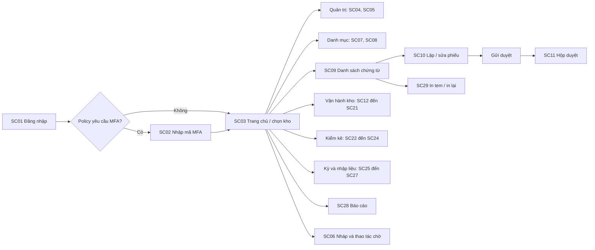
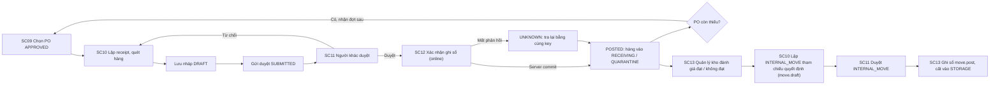
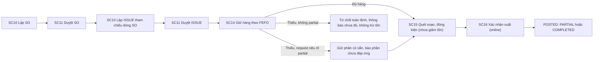
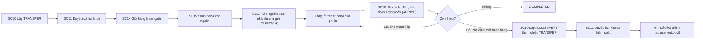
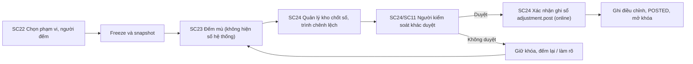
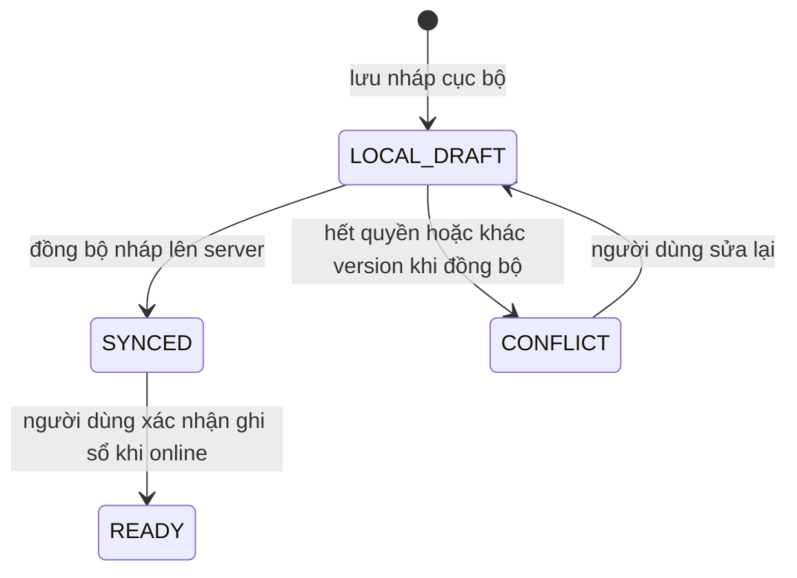
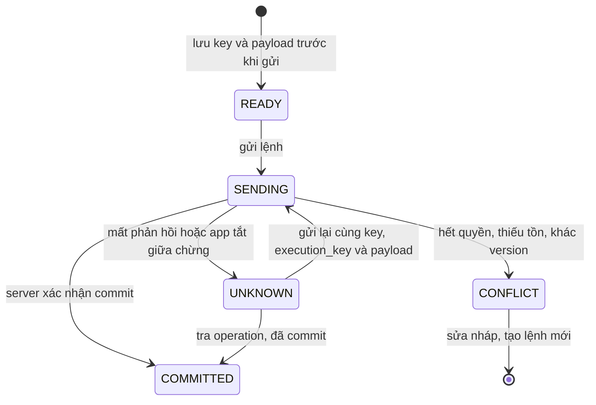

# Thiết kế luồng màn hình desktop (UI01)

> Cập nhật triển khai 02/10/2026: đây là bản luồng nhập từ PR #44. Các ghi chú bên dưới nói UC32/UC33 chưa có
> là trạng thái lúc soạn bản đó; hiện đã có yêu cầu, schema/API owner/bảo hành và tab tra serial.
> Ngày 03/10/2026 bổ sung tab [PO/SO và duyệt](ORDERS_APPROVAL.md) qua API thật; đã thêm tab [Nhận hàng](RECEIVING.md) tạo kế hoạch/duyệt/post từng phần. Phần dưới vẫn là thiết kế đích, chưa phải toàn bộ màn đã triển khai.
> Tab [Phục hồi nhận hàng](RECEIPT_RECOVERY.md) đã nối SQLite v2 và operation lookup/retry cho receipt.post sau đóng process; nháp và các loại lệnh khác chưa phục hồi bền qua UI.
> Đã tích hợp [Quản trị tài khoản/quyền](ADMIN_DESKTOP.md); ô **Chức năng** truy cập tám màn ở 900×690. OPENING mới có backend, chưa có màn desktop.
> Xem [TRACEABILITY.md](TRACEABILITY.md) cho cách dùng và giới hạn runtime; chưa có GUI tồn theo owner/ghi chứng cứ.

| Mục | Nội dung |
|---|---|
| Task | UI01 - Thiết kế luồng màn hình |
| Người thực hiện | TV3 - Vũ Thanh Thảo (Desktop Tkinter) |
| Reviewer | TL - Trần Trung Kiên |
| Mốc | M0 - Chốt phạm vi và hợp đồng |
| Ngày | 02/10/2026 |
| Trạng thái | DRAFT v0.3 - chờ TL xác nhận (đã sửa sau rà soát đối chiếu tài liệu) |

**Mục đích:** liệt kê màn hình của ứng dụng Tkinter, ai được dùng, gọi API nào, và các quy tắc giao diện bắt buộc. Làm căn cứ cho UI02 đến UI09.

**Nguồn:** `USE_CASES.md`, `04_Phan_quyen/role_permission_matrix.csv`, `04_Phan_quyen/permissions.csv`, `04_Phan_quyen/RBAC.md`, `uc_permissions.json`, `05_API/BA_COVERAGE.md`, `05_API/README.md`, `Class_Desktop.puml`, `ARCHITECTURE.md` (mục 4), `INVARIANTS.md`, `BA/07_RULES.md`, `document_states.csv`, `02_CSDL/local_drafts.sql`, `06_Nhap_lieu/imports/README.md`.

---

## 1. Danh sách màn hình

Cột "Trạng thái API": PARTIAL là đã có path trong OpenAPI nhưng chưa đủ luồng, MISSING là chưa có trong OpenAPI lõi (theo BA_COVERAGE.md). Với màn hình chưa đủ API, dự kiến UI làm bằng mock theo contract tạm, chờ TL xác nhận (câu hỏi 1, mục 6).

### 1.1. Xác thực và hệ thống

| Mã | Màn hình | UC | Vai trò dùng | Quyền cần | API | Trạng thái API |
|---|---|---|---|---|---|---|
| SC01 | Đăng nhập | UC01 | Mọi người dùng | Không cần phiên (có giới hạn thử) | /auth/login | MISSING |
| SC02 | Nhập mã MFA (khi đăng nhập; việc xác thực lại trước thao tác nhạy cảm là đề xuất, xem UR20) | UC29 | Mọi người dùng (nếu policy yêu cầu) | Không cần phiên đầy đủ | /auth/mfa | MISSING |
| SC03 | Trang chủ và chọn kho | UC01 | Mọi người dùng | Theo grant | /auth/refresh, tải quyền | MISSING |
| SC04 | Quản lý user và cấp vai trò theo kho | UC02 | SYSADMIN | iam.manage (user, khóa/thu hồi phiên), role.manage (grant); cả hai yêu cầu MFA | /users, /roles, /grants | MISSING |
| SC05 | Cập nhật phiên bản app | UC28 | SYSADMIN (phát hành), người dùng (cập nhật máy mình) | config.manage (MFA) cho phát hành | /client-policy | MISSING |
| SC06 | Trung tâm nháp và thao tác chờ | UC25 | Nhân viên kho có lập nháp hoặc ghi sổ phiếu (xem ghi chú mục 2 và câu hỏi 12) | Quyền của lệnh tương ứng | /operations/{key} | PARTIAL |

### 1.2. Danh mục

| Mã | Màn hình | UC | Vai trò | Quyền cần | API | Trạng thái API |
|---|---|---|---|---|---|---|
| SC07 | Hàng hóa, quy đổi đơn vị, barcode | UC03 | MASTER_DATA | master.write (xem: master.read) | /products, /uoms, /barcodes | MISSING |
| SC08 | Kho và vị trí | UC04 | MASTER_DATA | warehouse.configure | /warehouses, /locations | MISSING |

### 1.3. Chứng từ và duyệt

| Mã | Màn hình | UC | Vai trò | Quyền cần | API | Trạng thái API |
|---|---|---|---|---|---|---|
| SC09 | Danh sách chứng từ (lọc theo loại, trạng thái, kho). RECEIVER và PICKER chỉ thấy phiếu do mình lập hoặc được giao; trường kho khác bị che | Nhiều UC | BUYER, SELLER, RECEIVER, PICKER, WAREHOUSE_MANAGER, CONTROLLER, DIRECTOR, AUDITOR | document.read | /documents | MISSING |
| SC10 | Lập và sửa phiếu (PO, SO, Receipt, Issue, Transfer, Return, Move, Adjustment, Opening) | UC05, UC06, UC07, UC08, UC12, UC14, UC15, UC18, UC23 | BUYER (po.draft), SELLER (so.draft), RECEIVER (receipt.draft, move.draft), PICKER (issue.draft, move.draft), WAREHOUSE_MANAGER (transfer.draft, adjustment.draft), CONTROLLER (opening.draft); trả hàng xem SC19 | Quyền draft theo loại phiếu | /documents (tạo/sửa dòng), /documents/{id}/submit | PARTIAL (submit có; CRUD /documents MISSING) |
| SC11 | Hộp duyệt chứng từ | UC30 | WAREHOUSE_MANAGER (document.approve), CONTROLLER (adjustment.approve, opening.approve), DIRECTOR (opening.approve) | document.approve, adjustment.approve, opening.approve | /approval-requests/{id}/decide | PARTIAL |

### 1.4. Vận hành kho

| Mã | Màn hình | UC | Vai trò | Quyền cần | API | Trạng thái API |
|---|---|---|---|---|---|---|
| SC12 | Nhận hàng từng phần | UC06 | RECEIVER, WAREHOUSE_MANAGER | receipt.post | /receipts/{id}/post | PARTIAL |
| SC13 | Kiểm tra chất lượng và cất hàng | UC07 | WAREHOUSE_MANAGER (quality.decide), RECEIVER (move.draft, move.post) | quality.decide, move.post | /moves/{id}/post (endpoint quyết định chất lượng chưa có) | PARTIAL |
| SC14 | Giữ hàng theo lô/vị trí (cho ISSUE, TRANSFER, SUPPLIER_RETURN) | UC09 | PICKER, WAREHOUSE_MANAGER | reservation.manage | /issues/{id}/reserve (chưa rõ cho TRANSFER và trả NCC; release giữ chỗ chưa có) | PARTIAL |
| SC15 | Soạn hàng và đóng kiện | UC10 | PICKER, WAREHOUSE_MANAGER | pick.confirm | /pick-tasks, /packages (README liệt kê cần bổ sung, chưa có trong OpenAPI) | MISSING |
| SC16 | Xuất hàng từng phần | UC11 | PICKER, WAREHOUSE_MANAGER | issue.post | /issues/{id}/post | PARTIAL |
| SC17 | Xuất chuyển kho (kho nguồn) | UC12 | PICKER, WAREHOUSE_MANAGER | transfer.dispatch | /transfers/{id}/dispatch | PARTIAL |
| SC18 | Nhận chuyển kho (kho đích) | UC13 | RECEIVER, WAREHOUSE_MANAGER | transfer.receive | /transfers/{id}/receive | PARTIAL |
| SC19 | Khách trả hàng / Trả nhà cung cấp (trả NCC: chọn lô/serial và giữ hàng qua SC14) | UC14, UC15 | Lập: BUYER, SELLER, RECEIVER. Ghi sổ: WAREHOUSE_MANAGER | return.draft, return.post (ngoại lệ: return.unlinked, cần lý do) | /returns/{id}/post | PARTIAL |
| SC20 | Hủy hoặc đóng phần còn lại | UC19 | WAREHOUSE_MANAGER | document.cancel | /documents/{id}/cancel | PARTIAL |
| SC21 | Đảo lần ghi sổ sai | UC20 | CONTROLLER | adjustment.approve, adjustment.post | /adjustments/{id}/post (endpoint tạo phiếu REVERSAL chưa có) | PARTIAL |

### 1.5. Kiểm kê, kỳ và nhập liệu

| Mã | Màn hình | UC | Vai trò | Quyền cần | API | Trạng thái API |
|---|---|---|---|---|---|---|
| SC22 | Mở phiên kiểm kê | UC16 | WAREHOUSE_MANAGER | count.create | /counts/{id}/freeze (tạo phiên /counts chưa có) | PARTIAL |
| SC23 | Đếm mù và đếm lại (cho phép thêm hàng ngoài snapshot, số gốc 0) | UC17 | RECEIVER, PICKER, WAREHOUSE_MANAGER (người được giao) | count.enter | /counts và observations | MISSING |
| SC24 | Duyệt kiểm kê và điều chỉnh | UC18 | WAREHOUSE_MANAGER (trình), CONTROLLER (duyệt, ghi sổ) | count.submit, count.snapshot.read, adjustment.approve, adjustment.post | /counts/{id}/submit, /adjustments/{id}/post | PARTIAL |
| SC25 | Khóa/mở kỳ (mở lại kỳ yêu cầu MFA; xác thực lại ngay trước thao tác là đề xuất, xem UR20) | UC21 | CONTROLLER (khóa), DIRECTOR (mở lại) | period.close, period.reopen (MFA) | (chưa có) | MISSING |
| SC26 | Import và kết quả kiểm tra file (hiển thị lỗi từng dòng, xem mục 5.1) | UC22, UC31 | MASTER_DATA, CONTROLLER | import.validate, import.commit | /imports/{id}/commit | PARTIAL (phần validate MISSING) |
| SC27 | Nạp tồn đầu kỳ | UC23 | CONTROLLER (lập, ghi sổ), CONTROLLER/DIRECTOR (duyệt, khác người lập) | opening.draft, opening.approve, opening.post | /openings/{id}/post | PARTIAL |

### 1.6. Báo cáo và in ấn

| Mã | Màn hình | UC | Vai trò | Quyền cần | API | Trạng thái API |
|---|---|---|---|---|---|---|
| SC28 | Báo cáo R01-R08 và xuất file | UC24 | WAREHOUSE_MANAGER (chỉ xem), CONTROLLER, DIRECTOR, AUDITOR | report.read, report.export, price.read (nếu có giá) | /reports, /exports | MISSING |
| SC29 | In tem và in lại chứng từ | UC26 | RECEIVER, PICKER, WAREHOUSE_MANAGER | print.execute, document.read | (chưa có) | MISSING |

### 1.7. Không có màn hình trong app desktop

| UC / quyền | Lý do |
|---|---|
| UC27 Sao lưu và khôi phục | Tác vụ hạ tầng của SYSADMIN theo runbook, không có API sửa kho nên không làm màn hình nghiệp vụ. |
| UC32 Hàng ký gửi theo chủ sở hữu | Không có trong `USE_CASES.md` (hiện UC01-UC31). Đây là phạm vi suy ra từ câu hỏi Q02, chưa có UC, schema, quyền và API. Chưa thiết kế màn hình (xem mục 6). |
| UC33 Tra serial và bảo hành | Như trên. |
| audit.read, audit.security.read, price.write | Có trong `permissions.csv` nhưng chưa có UC tương ứng nên chưa có màn hình. Hỏi TL ở mục 6. |

---

## 2. Menu theo vai trò

Menu chỉ để người dùng dễ tìm. **Quyền thật luôn do server kiểm tra** (BR01). Mỗi người có thể có nhiều vai trò ở nhiều kho, nên menu được dựng từ tập quyền của kho đang chọn.

| Nhóm menu | SYSADMIN | MASTER_DATA | BUYER | SELLER | RECEIVER | PICKER | WAREHOUSE_MANAGER | CONTROLLER | DIRECTOR | AUDITOR |
|---|---|---|---|---|---|---|---|---|---|---|
| Quản trị (SC04, SC05) | Có | | | | | | | | | |
| Danh mục (SC07, SC08) | | Có | xem | xem | xem | xem | xem | xem | xem | xem |
| Chứng từ (SC09, SC10) | | | PO, Trả | SO, Trả | Nhận, Trả, Chuyển vị trí | Xuất, Chuyển vị trí | Chuyển, Điều chỉnh | Tồn đầu kỳ | xem | xem |
| Hộp duyệt (SC11) | | | | | | | Có | Có | Có (tồn đầu kỳ) | |
| Nhận và cất (SC12, SC13, SC18) | | | | | Có | | Có | | | |
| Giữ, soạn, xuất (SC14 đến SC17) | | | | | | Có | Có | | | |
| Trả hàng (SC19) | | | Lập | Lập | Lập | | Ghi sổ | | | |
| Hủy/đóng, đảo (SC20, SC21) | | | | | | | Hủy/đóng | Đảo | | |
| Kiểm kê (SC22 đến SC24) | | | | | Đếm | Đếm | Mở, đếm, trình | Duyệt | | xem |
| Kỳ và nhập liệu (SC25 đến SC27) | | Import | | | | | | Khóa kỳ, Import, Tồn đầu kỳ | Mở lại kỳ | |
| Báo cáo (SC28) | | | | | | | Xem | Xem, xuất | Xem, xuất | Xem, xuất |
| In ấn (SC29) | | | | | Có | Có | Có | | | |
| Nháp và thao tác chờ (SC06) | | | Có | Có | Có | Có | Có | Có | | |

Ghi chú:
- SC06 hiện cho các vai trò có lập nháp hoặc ghi sổ phiếu kho (BUYER, SELLER, RECEIVER, PICKER, WAREHOUSE_MANAGER, CONTROLLER). SYSADMIN và AUDITOR không có lệnh kho nên không hiện. MASTER_DATA (import commit) và DIRECTOR (mở lại kỳ) có lệnh ghi nhưng không phải phiếu kho, cần TL xác nhận (câu hỏi 12).
- SYSADMIN không có quyền nghiệp vụ kho theo mặc định (xem `RBAC.md`), nên menu của SYSADMIN chỉ có Quản trị.
- Chưa có mục menu cho audit.read / audit.security.read / price.write (xem 1.7).

---

## 3. Luồng điều hướng

### 3.1. Tổng quan

### 3.2. Nhận hàng đến cất hàng (P01, UC06, UC07, UC30)

### 3.3. Xuất hàng (P02, UC08, UC09, UC10, UC11)

### 3.4. Chuyển kho (P04, UC09, UC10, UC12, UC13)

Ví dụ: gửi 20, nhận 18 thì transit còn 2 (T04). Mất hoặc hỏng phải lập phiếu ADJUSTMENT riêng (SC10 rồi SC11), không tự điều chỉnh khi nhận. Theo UC19, hủy hoặc đóng phần còn lại không được làm mất lịch sử dispatch; hàng còn ở transit phải xử lý riêng (ADJUSTMENT nếu mất hoặc hỏng), xem SC20.

### 3.5. Kiểm kê (P03, UC16, UC17, UC18)

### 3.6. Trạng thái hiển thị (UC25)

Hai thực thể cục bộ khác nhau (xem `02_CSDL/local_drafts.sql`), nên tách thành hai sơ đồ.

**a) Nháp cục bộ (`local_draft`)**

**b) Thao tác ghi sổ (`pending_operation`)**

Ánh xạ tên hiển thị: LOCAL_DRAFT hiện là **DRAFT**; SYNCED hiện là **SYNCED**; COMMITTED hiện là **POSTED**; UNKNOWN và CONFLICT giữ nguyên; SENDING hiện "Đang gửi"; READY hiện "Sẵn sàng gửi". SYNCED chỉ là "nháp đã đồng bộ", **không phải POSTED**.

---

## 4. Quy tắc giao diện bắt buộc

| Mã | Quy tắc | Căn cứ |
|---|---|---|
| UR01 | Các trạng thái DRAFT, SYNCED, UNKNOWN, POSTED, CONFLICT hiển thị khác nhau rõ ràng (kèm "Sẵn sàng gửi" cho READY và "Đang gửi" cho SENDING). Chỉ hiện POSTED khi server xác nhận commit. | BR10, NFR03, T08, `local_drafts.sql` |
| UR02 | Nút ghi sổ chỉ bấm được khi online. Bị khóa trong lúc gửi nhưng server vẫn bắt buộc idempotency. | BR04, BR10 |
| UR03 | Lưu key và payload vào SQLite cục bộ trước khi gửi. Mất phản hồi chuyển UNKNOWN, tra `/operations/{key}`, chỉ gửi lại bằng **cùng key, cùng `execution_key` và payload**. Mỗi lần post từng phần là một `execution_key` mới. Kết quả NOT_FOUND không có nghĩa lệnh cũ chưa chạy, nên không tạo key mới. Không rollback giả trên UI. | BR05, T02, `INVARIANTS.md`, `post_sequence.puml` |
| UR04 | Không tự gửi lệnh ghi sổ từ các lần quét offline khi mạng trở lại. | UC25, T08 |
| UR05 | Màn hình đếm mù không hiện `snapshot_quantity`. Số hệ thống và chênh lệch ở màn hình riêng (SC24) cho người có `count.snapshot.read`. Màn hình đếm phải cho thêm hàng ngoài snapshot (số gốc 0). | BR09, UC17 |
| UR06 | Ẩn giá nếu thiếu `price.read`. Ẩn nút không thay cho kiểm soát quyền ở server. | BR01, T07, T21 |
| UR07 | Người tạo hoặc gửi phiếu không có nút duyệt phiếu của mình. Với kiểm kê, người lập và mọi người đếm không được duyệt. Hai bước duyệt phải khác người. Server vẫn chặn (SELF_APPROVAL). | BR02 |
| UR08 | Phiếu SUBMITTED không cho sửa nội dung. Muốn sửa phải hủy yêu cầu duyệt (invalidate) để về DRAFT rồi gửi duyệt lại. Phiếu REJECTED sửa được để về DRAFT; phiếu APPROVED chưa post có thể revise về DRAFT. | BR11, `05_API/README.md`, `document_states.csv` |
| UR09 | Lỗi hiển thị theo mã server cùng `request_id` (xem mục 5). Giữ nguyên dữ liệu người dùng đã nhập để sửa. | UC (ngoại lệ chung) |
| UR10 | Danh sách phân trang theo cursor, mặc định 100 dòng, tối đa 200, sắp xếp ổn định (key, id). Tìm kiếm có debounce, quét barcode là tra chính xác. Không tải toàn bộ SKU vào Treeview. | ARCHITECTURE mục 4, `05_API/README.md` |
| UR11 | Mọi widget chỉ cập nhật trên main thread. HTTP chạy ở worker, kết quả qua queue rồi `after()` cập nhật UI. Mỗi request có số thứ tự để bỏ kết quả cũ khi đã đổi phiếu. | ARCHITECTURE mục 4, `Class_Desktop.puml` |
| UR12 | Nhập liệu bằng bàn phím và máy quét HID (Tab, Enter, quét). Ô nhập tự focus. Giữ số 0 đầu của mã/barcode/serial (là chuỗi văn bản). Tiếng Việt hiển thị rõ. | NFR07, T22 |
| UR13 | Số lượng nhập và hiển thị theo chuỗi decimal, không dùng float. Không cộng đơn vị khác loại. | BR07 |
| UR14 | Token giữ trong RAM hoặc kho bí mật của OS, không ghi vào SQLite và log. Không có kho bí mật thì bắt đăng nhập lại. | UC01, T11 |
| UR15 | Hỏi xác nhận (tóm tắt trước khi ghi sổ) với mọi lệnh ghi sổ. Xuất file CSV chống formula injection do server xử lý. | UC11, UC24 |
| UR16 | In hoặc in lại chứng từ không bao giờ ghi sổ lại. Lỗi máy in giữ file, không ảnh hưởng tồn. | UC26, T22 |
| UR17 | Nâng cấp app phải giữ nháp và thao tác chờ. Client quá cũ bị chặn ghi nhưng vẫn giữ nháp. | UC28, T23 |
| UR18 | Mỗi lệnh ghi sổ gửi tối đa 200 dòng; import chứng từ tối đa 200 dòng mỗi phiếu. Giao diện báo rõ và chặn khi vượt giới hạn. | `openapi_core.json` (lines maxItems 200), `06_Nhap_lieu/imports/README.md` |
| UR19 | Mỗi lần quét sinh một UUID (`scan_event_key`) để server chống lặp. Hai lần quét khác UUID không được tự gộp. | UC10, UC17, `local_drafts.sql` |
| UR20 | **Đề xuất, chờ TL xác nhận:** SC04, SC05 và thao tác mở lại kỳ ở SC25 yêu cầu MFA (`permissions.csv` ghi điều kiện MFA cho iam.manage, config.manage, period.reopen). Tài liệu chưa nói rõ MFA ở lúc đăng nhập hay xác thực lại ngay trước thao tác (step-up); UI dự kiến xác thực lại trước khi gửi lệnh. | `permissions.csv`, `RBAC.md` (MFA khi cần) |
| UR21 | Đăng nhập thất bại hiển thị thông báo chung, không tiết lộ tài khoản có tồn tại hay không; hiển thị rõ khi bị giới hạn số lần thử. | UC01 |

---

## 5. Hiển thị lỗi theo mã server

| Mã / HTTP | Ý nghĩa | UI nên làm |
|---|---|---|
| STALE_VERSION (409) | Phiếu đã bị người khác sửa | Báo "dữ liệu đã thay đổi", tải lại, giữ phần đã nhập để so sánh. |
| IDEMPOTENCY_MISMATCH (409) | Cùng key nhưng khác nội dung | Không gửi lại. Báo lỗi và tạo thao tác mới có kiểm tra. |
| INSUFFICIENT_STOCK (409) | Thiếu tồn | Hiện dòng thiếu, giữ nháp, không tự giảm lượng. |
| INVALID_STATE (409) | Sai trạng thái phiếu | Tải lại trạng thái, ẩn hành động không còn hợp lệ. |
| SERIAL_IN_USE, TRACKING_MISMATCH | Serial trùng hoặc sai lô/serial | Tô đỏ dòng lỗi, cho sửa. |
| COUNT_LOCKED | Vị trí đang kiểm kê | Báo vị trí bị khóa, không cho thao tác. |
| PERIOD_CLOSED | Kỳ đã khóa | Báo ngày nghiệp vụ thuộc kỳ đã đóng. |
| APPROVAL_REQUIRED | Chưa đủ bước duyệt | Chỉ đến hộp duyệt hoặc người duyệt. |
| SELF_APPROVAL | Tự duyệt | Báo không được tự duyệt phiếu của mình. |
| SOURCE_QUANTITY_EXCEEDED | Vượt lượng nguồn (PO/SO/xuất) | Hiện lượng còn lại tối đa. |
| 401 | Hết phiên | Về SC01, giữ nháp. |
| 403 | Thiếu quyền (đã được phép thấy tài nguyên), hoặc quyền bị thu hồi khi tra operation/tải file | Báo "không có quyền thực hiện". |
| 404 | Không tồn tại **hoặc ngoài phạm vi kho** | Báo chung "không tìm thấy hoặc không có quyền xem", không tiết lộ lý do. |
| 422 | Dữ liệu không hợp lệ | Hiện lỗi theo từng dòng/trường (`field_errors`). |
| 503 / timeout | Tạm thời không phục vụ | Chuyển UNKNOWN, tra operation trước khi thử lại. |

### 5.1. Mã lỗi import (SC26)

Theo `06_Nhap_lieu/imports/README.md`, mỗi lỗi có `job_id`, `row_no`, `column`, `code`, `message`, `suggested_fix`. SC26 hiển thị bảng lỗi theo dòng và cột, cho tải lại file sau khi sửa.

| Mã | UI nên làm |
|---|---|
| REQUIRED, INVALID_TYPE, QUANTITY_PRECISION | Tô đỏ ô sai, hiện gợi ý sửa. |
| DUPLICATE_KEY, SERIAL_DUPLICATE | Hiện các dòng trùng. |
| UNKNOWN_REFERENCE, WRONG_WAREHOUSE, INVALID_TRACKING | Hiện tham chiếu hoặc kho/tracking sai. |
| FORBIDDEN, CLOSED_PERIOD, STALE_VERSION | Báo thiếu quyền, kỳ đóng hoặc dữ liệu đã đổi; phải kiểm tra lại. File đổi sau validate (hash khác) phải chạy lại validate. |

---

## 6. Điểm hở và câu hỏi cho TL

1. **API còn thiếu:** SC01 đến SC08, SC09, SC15, SC23, SC25, SC28, SC29 chưa có path trong OpenAPI. Các màn hình PARTIAL cũng thiếu endpoint con: quyết định chất lượng (SC13), tạo phiếu REVERSAL (SC21), tạo phiên kiểm kê (SC22), release giữ chỗ và giữ cho TRANSFER/trả NCC (SC14), CRUD /documents (SC10). UI02 có làm mock theo contract tạm không, và ai chốt contract (BE01)?
2. **Màn hình cấp quyền (SC04):** v1 dùng biên bản bên ngoài, chưa có workflow phê duyệt cấp quyền trong schema. Màn hình chỉ cấp grant và hiện `approval_reference`, đúng không? Màn hình cũng cần quyền `iam.manage` cho phần user và khóa phiên.
3. **UC32 Hàng ký gửi, UC33 Bảo hành serial:** hai mã này không có trong `USE_CASES.md` hiện tại. Có đưa vào đợt này không? Nếu có thì cần schema, quyền, API và thêm cột "chủ sở hữu" ở các màn hình tồn/giữ/xuất/kiểm kê, cùng màn hình tra serial.
4. **Chọn kho:** đề xuất chọn kho ở SC03 rồi dựng menu theo grant của kho đó (khớp `RBAC.md`: không gộp quyền các kho). Ngoại lệ: mục GLOBAL (SYSADMIN, MASTER_DATA) không phụ thuộc kho; phiếu chuyển kho cần quyền ở cả hai kho. Hộp duyệt có hiện gộp nhiều kho không, hay phải đổi kho mới thấy?
5. **Duyệt trong app:** mọi loại phiếu dùng chung SC11 hay tách màn hình duyệt riêng cho kiểm kê (SC24) và tồn đầu kỳ?
6. **Thiết bị:** model máy in tem và khổ tem chưa chốt (Q06; theo dõi bởi QA07/QA10 trong open_questions.json). Cần cho SC29 và T22.
7. **UC27 Backup:** xác nhận không làm màn hình trong app (chỉ runbook).
8. **UC20 đảo ghi sổ:** CONTROLLER chọn giao dịch gốc và duyệt/ghi sổ, nhưng chỉ WAREHOUSE_MANAGER có `adjustment.draft`. Ai là người lập phiếu REVERSAL và ai duyệt (người duyệt phải khác người lập)?
9. **Rút lại phiếu SUBMITTED:** `document_states.csv` không có chuyển SUBMITTED → DRAFT, còn `05_API/README.md` nói phải invalidate request. Cần chốt trạng thái và endpoint cho thao tác "hủy duyệt" (liên quan UR08).
10. **Quyền chưa có màn hình:** audit.read, audit.security.read, price.write có đưa vào app không, hay để ngoài phạm vi?
11. **MFA khi thao tác nhạy cảm (UR20):** MFA chỉ ở lúc đăng nhập, hay phải xác thực lại ngay trước khi cấp quyền, đổi cấu hình, mở lại kỳ?
12. **SC06 cho MASTER_DATA và DIRECTOR:** hai vai trò này có lệnh ghi (import commit, mở lại kỳ) nhưng không phải phiếu kho. Có hiện mục Nháp và thao tác chờ không?
