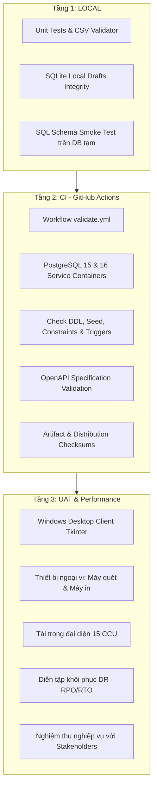
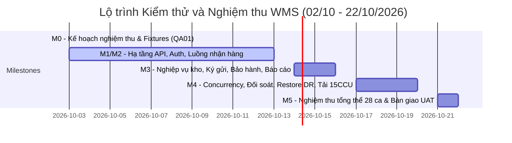

# Kế hoạch Nghiệm thu và Fixtures kiểm thử WMS

WMS-QA-001 • Phiên bản 1.0 • Ngày 02/10/2026 • Tài liệu đặc tả kế hoạch nghiệm thu chi tiết

- **Đầu việc:** QA01 (Theo dõi tại [Issue #20](https://github.com/TEAM-DEV-FIVE/WMS_BA_2_0/issues/20))
- **Người phụ trách (Assignee):** Lê Ngọc Quỳnh Khanh (TV4)
- **Người đánh giá (Reviewer):** Trần Trung Kiên (Tech Lead)
- **Căn cứ pháp lý & baseline:** [Phạm vi và baseline TL01 ngày 02/10/2026](../01_Tai_lieu/SCOPE_BASELINE.md), [Bất biến nghiệp vụ](../01_Tai_lieu/INVARIANTS.md), [Kiến trúc hệ thống](../01_Tai_lieu/ARCHITECTURE.md)
- **Hạn chốt kế hoạch:** 02/10/2026 • **Hạn bàn giao nghiệm thu toàn diện:** 22/10/2026

---

## 1. Mục tiêu và Nguyên tắc kiểm thử

### 1.1. Mục tiêu
Chuyển đổi toàn bộ yêu cầu nghiệp vụ ([BRD](../01_Tai_lieu/BA/01_BRD.md), [SRS](../01_Tai_lieu/BA/03_SRS.md)), 49 yêu cầu chức năng (FR01–FR33), 33 Use Cases (UC01–UC33) và các bất biến số dư kho thành một **kế hoạch kiểm thử có khả năng tái lập độc lập (reproducible)**, đi kèm bộ dữ liệu mẫu (fixtures/seeds), phân định rõ ràng trách nhiệm thực thi và nơi lưu trữ bằng chứng xác thực.

### 1.2. Nguyên tắc nghiệm thu cốt lõi
1. **Không đánh dấu "Đạt" khi chưa chạy thực tế:** Đặc tả test case không đồng nghĩa với việc đã nghiệm thu. Mọi trạng thái Đạt (PASS) bắt buộc phải có log thực thi, kết quả truy vấn đối soát hoặc ảnh chụp màn hình/video UAT đính kèm.
2. **Bảo toàn bất biến số dư (Stock Invariants):**
   - Không bao giờ để tồn kho vật lý (`on_hand`), tồn khả dụng (`available`) hoặc tồn theo lô/serial bị âm.
   - Sổ cái kho (`stock_move` / `inventory_transaction`) là append-only, tuyệt đối không sửa (`UPDATE`) hoặc xóa (`DELETE`).
   - Lệnh hủy hoặc đảo giao dịch (reversal) phải tạo bút toán đối ứng mới và kiểm tra điều kiện tồn kho nguồn.
3. **Phân tách nhiệm vụ (Separation of Duties - SOD):** Người lập phiếu không được phép tự duyệt phiếu của chính mình (áp dụng cho đơn mua, đơn bán, phiếu kiểm kê, xuất trả hàng).
4. **Phân định rõ ràng giữa Target thiết kế và Kết quả đo thực tế:** Các chỉ số như RPO < 1 giờ, RTO < 4 giờ, độ trễ p95/p99 phải được đo bằng benchmark và diễn tập khôi phục thực tế, không lấy giả định thiết kế thay thế kết quả đo.

---

## 2. Tiêu chuẩn đo lường kỹ thuật định lượng (Metric Standards)

Theo chỉ đạo tại [SCOPE_BASELINE.md (mục 6)](../01_Tai_lieu/SCOPE_BASELINE.md), các chỉ số vận hành được lượng hóa tường minh trước khi bước vào kiểm thử:

### 2.1. Đo sai lệch tồn kho (< 0,5%)
* **Công thức xác định theo từng nhóm Base UOM:**
  Nhằm đảm bảo tính đồng nhất về bản chất phép đo vật lý, sai lệch tồn kho được phân nhóm và tính toán riêng biệt cho từng Đơn vị tính chuẩn (Base UOM) $u$ (hoặc phân rã theo từng SKU):
  $$\text{Tỷ lệ sai lệch theo Base UOM } u = \frac{\sum_{i \in \text{SKU}(u)} |\text{Số lượng thực tế}_i - \text{Số lượng sổ sách}_i|}{\sum_{i \in \text{SKU}(u)} \text{Số lượng sổ sách}_i} \times 100\%$$
  *Tuyệt đối không cộng dồn số học các đơn vị tính cơ sở khác loại (như cộng CUON với VIEN, CAI, KG) trong cùng một công thức tỷ lệ số lượng.*
* **Mẫu số chốt:** Tổng số lượng tồn vật lý theo Base UOM của tất cả SKU thuộc nhóm UOM đó nằm trong phạm vi đợt kiểm kê tại thời điểm chụp snapshot dữ liệu (`freeze location`).
* **Điều kiện hợp lệ và Xử lý mẫu số bằng 0:**
  - Công thức trên chỉ áp dụng khi mẫu số lớn hơn 0 ($\sum \text{Số lượng sổ sách} > 0$).
  - **Trường hợp mẫu số bằng 0:** Nếu tổng tồn sổ sách của nhóm SKU/UOM bằng 0 nhưng kiểm kê thực tế phát hiện có hàng, tỷ lệ sai lệch số lượng được ghi nhận kết quả là `N/A` (không xác định số học, tránh lỗi chia cho 0).
  - **Không tự ý chuyển đổi sang phép đo bằng giá trị tiền tệ** trong công thức tỷ lệ số lượng, tránh làm méo mó bản chất và sai lệch thang đo.
  - Toàn bộ số lượng hàng phát hiện thừa khi sổ sách bằng 0 được bóc tách riêng vào **Biên bản phát hiện hàng bất thường (Abnormal Discovery Report)** để truy tìm nguồn gốc lô/chủ sở hữu và xử lý nhập kho riêng biệt.
  - **Quy tắc tổng hợp cấp kho / toàn hệ thống:** Hệ thống đánh giá đạt chuẩn khi 100% các nhóm Base UOM hợp lệ đều đạt tỷ lệ sai lệch $< 0,5\%$, đồng thời không phát sinh hàng bất thường vượt hạn mức rủi ro. Báo cáo chênh lệch giá trị tài chính (tổng hợp theo VNĐ dựa trên giá vốn kế toán) được lập thành biểu mẫu riêng phục vụ đối chiếu kế toán. *Quy tắc tổng hợp mới này đang chờ Tech Lead Trần Trung Kiên phê duyệt chính thức trước khi áp dụng vào đợt kiểm kê diện rộng tại mốc M3/M5.*
* **Ngưỡng chấp nhận:** Tỷ lệ sai lệch trên từng nhóm Base UOM phải $< 0,5\%$. Toàn bộ chênh lệch đều phải có phiếu điều chỉnh kiểm kê được duyệt qua 2 bước (T05).

### 2.2. Đo thời gian xử lý phiếu (< 15 phút)
* **Quy chuẩn SLA toàn chu trình:** Thống nhất xuyên suốt theo đúng mục tiêu vận hành và baseline hiệu năng (NFR-Q07, T26):
  $$T_{\text{lifecycle}} = T_{\text{posted}} - T_{\text{start}} < 15\text{ phút}$$
* **Điểm bắt đầu ($T_{\text{start}}$):** Thời điểm nhân viên mở form tạo phiếu mới trên Desktop Client hoặc quét mã vạch dòng sản phẩm đầu tiên.
* **Điểm kết thúc ($T_{\text{posted}}$):** Thời điểm hệ thống trả về mã HTTP 200/201 kèm trạng thái `POSTED` trên giao diện, số dư sổ cái (`stock_move` / `inventory_transaction`) được ghi nhận thành công tại PostgreSQL trung tâm.
* **Quy tắc đối với phiếu có bước phê duyệt quản lý (như phiếu kiểm kê T05, phiếu xuất trả T10):**
  - Thời gian thao tác trực tiếp của nhân viên ($T_{\text{submit}} - T_{\text{start}}$) được theo dõi như một **chỉ số phụ trợ nội bộ (Internal Auxiliary Metric)** với mục tiêu khuyến nghị $< 5\text{ phút}$.
  - Thời gian chờ người quản lý phê duyệt (Approval Queue Time) được theo dõi theo SLA ca làm việc quản lý.
  - Khi thực hiện kiểm thử tải đại diện 15 CCU và benchmark end-to-end (T26), toàn bộ chu trình từ mở form đến khi hoàn tất phê duyệt và ghi sổ thành công vẫn phải đảm bảo đạt ngưỡng chuẩn $< 15\text{ phút}$.

### 2.3. Đo tải trọng 15 CCU & Độ trễ (Workload & Latency Benchmark)
* **Quy mô baseline:** 1 kho trung tâm với 3 phân khu, tối đa 15 người dùng đồng thời (15 CCU), bộ dữ liệu hoạt động khoảng 20 GB trong 3 năm.
* **Phân bổ kịch bản tải 15 CCU:**
  - 5 CCU: Tra cứu danh mục, kiểm tra tồn kho tức thời tại các vị trí.
  - 5 CCU: Quét mã vạch nhập dòng, tạo phiếu nhập/xuất/chuyển kho.
  - 3 CCU: Post ghi sổ giao dịch (posting transactions) đồng thời.
  - 2 CCU: Chạy truy vấn báo cáo Nhập-Xuất-Tồn (R02) và Thẻ kho (R03).
* **Chỉ số đo đạc:** Thu thập thời gian phản hồi ở phân vị **p95** và **p99** tại API Gateway/Reverse Proxy trong phiên chạy liên tục 60 phút (T26). Ghi nhận trung thực cấu hình CPU, RAM, Disk I/O của máy chủ thử nghiệm.

### 2.4. Đo mục tiêu phục hồi thảm họa (RPO < 1 giờ, RTO < 4 giờ)
* **Phương pháp kiểm chứng:** Diễn tập phục hồi thảm họa thực tế trên máy chủ phụ trợ (Standby / DR Server) độc lập (T09):
  - **RTO (Recovery Time Objective):** Tính từ thời điểm phát lệnh khôi phục đến khi:
    1. Cơ sở dữ liệu PostgreSQL khởi động hoàn tất và nạp lại dữ liệu từ Base Backup + WAL archive;
    2. Chạy script đối soát toàn vẹn `02_CSDL/reconcile.sql` thành công và xác nhận đúng **0 dòng chênh lệch** trên toàn bộ 4 truy vấn đối soát;
    3. Ứng dụng Desktop Client kết nối thành công và người dùng (`user_wm_wh01`) đăng nhập bình thường vào hệ thống.
    *Mục tiêu:* $\text{RTO} < 4\text{ giờ}$ theo đúng định nghĩa điểm kết thúc xuyên suốt giữa tài liệu và kịch bản T09.
  - **RPO (Recovery Point Objective):** Độ lệch thời gian giữa giao dịch cuối cùng được khôi phục thành công từ WAL archive so với thời điểm máy chủ chính gặp sự cố giả lập. Mục tiêu: $\text{RPO} < 1\text{ giờ}$.
* **Tiêu chí nghiệm thu DR:** Script `02_CSDL/reconcile.sql` phải trả về đúng **0 dòng chênh lệch** trên toàn bộ 4 truy vấn đối soát:
  1. Ledger vs Stock Balance.
  2. Active Serials vs Serial Positions.
  3. Reserved Balance vs Active Reservations.
  4. In-transit Balance vs Transfer Documents.

---

## 3. Bộ dữ liệu Fixtures tái lập chuẩn hóa (Standard Reproducible Fixtures)

Tất cả các ca kiểm thử nghiệm thu T01–T28 đều sử dụng bộ dữ liệu mẫu định danh thống nhất. Toàn bộ thông số fixtures đã được cấu trúc hóa thành file máy đọc tại [`07_Kiem_tra/fixtures/acceptance_fixtures.json`](fixtures/acceptance_fixtures.json).

### 3.1. Danh mục 10 vai trò chính thức & Tài khoản thử nghiệm
Hệ thống sử dụng đúng 10 vai trò chuẩn hóa được quy định tại [`04_Phan_quyen/roles.csv`](../04_Phan_quyen/roles.csv) và ma trận quyền [`04_Phan_quyen/role_permission_matrix.csv`](../04_Phan_quyen/role_permission_matrix.csv). Tuyệt đối không sử dụng các role tự tạo không nằm trong danh mục.

| Username | Vai trò chính thức (Role) | Kho được cấp quyền (Warehouse Scope) | Mục đích sử dụng & Ranh giới phân quyền |
| :--- | :--- | :--- | :--- |
| `admin` | `SYSADMIN` | Toàn hệ thống (GLOBAL) | Quản trị người dùng, cấu hình kỹ thuật, thu hồi phiên; không làm nghiệp vụ kho. |
| `user_wm_wh01` | `WAREHOUSE_MANAGER` | Kho trung tâm (WH01) | Quản lý kho WH01: duyệt chứng từ thường (`document.approve`), tạo và nộp kiểm kê (`count.create`, `count.submit`), quản lý giữ chỗ/xuất kho; **bị DENY tuyệt đối quyền đóng kỳ (`period.close`) và post điều chỉnh kiểm kê (`adjustment.post`)**. |
| `user_controller_wh01` | `CONTROLLER` | Kho trung tâm (WH01) | Kiểm soát/kế toán kho WH01: duyệt bước 1 điều chỉnh kiểm kê (`adjustment.approve`), ghi sổ điều chỉnh (`adjustment.post`), đóng kỳ kho (`period.close`), xem giá vốn (`price.read`), xuất báo cáo (`report.export`). |
| `user_receiver_wh01` | `RECEIVER` | Kho trung tâm (WH01) | Nhân viên nhận hàng WH01: lập/post phiếu nhập (`receipt.post`), chuyển vị trí (`move.perform`), đếm kiểm kê lần 1 (`count.enter`); không có quyền xem giá vốn. |
| `user_picker_wh01` | `PICKER` | Kho trung tâm (WH01) | Nhân viên soạn hàng WH01: xác nhận nhặt hàng, đóng kiện, xuất kho, đếm kiểm kê lần 2 (`count.enter` đối chứng). |
| `user_director` | `DIRECTOR` | Kho trung tâm (WH01) | Ban điều hành: phê duyệt bước 2 điều chỉnh kiểm kê (bắt buộc độc lập với Controller), mở lại kỳ kho (`period.reopen`), duyệt tồn đầu kỳ (`opening.approve`), xem giá và xuất báo cáo. |
| `user_auditor` | `AUDITOR` | Kho trung tâm (WH01) | Kiểm toán viên: chỉ đọc báo cáo tồn kho, thẻ kho, nhật ký audit trail, xuất báo cáo đối soát. |
| `user_multi_grant` | `WAREHOUSE_MANAGER` @ WH01 `RECEIVER` @ WH02 | WH01 (Quản lý) WH02 (Nhận hàng) | Kiểm thử T07 (RBAC & Data Scope): Có quyền quản lý tại WH01 nhưng chỉ có quyền nhận hàng tại WH02 (bị cấm gộp quyền chéo kho). Kho **WH03** nằm ngoài phạm vi được cấp quyền hoàn toàn. |

> [!IMPORTANT]
> **Quy tắc phản hồi lỗi phân quyền & phạm vi dữ liệu (RBAC Data Scope):**
> Theo chuẩn kiến trúc tại [`05_API/README.md`](../05_API/README.md):
> 1. Truy cập tài nguyên trong kho được cấp quyền nhưng thiếu quyền thực hiện hành động $\rightarrow$ Trả về mã lỗi **`403 Forbidden`** (Ví dụ: `user_multi_grant` duyệt phiếu tại WH02).
> 2. Truy cập tài nguyên thuộc kho nằm ngoài phạm vi được cấp quyền $\rightarrow$ Trả về mã lỗi **`404 Not Found`** để không làm lộ sự tồn tại của kho ngoài scope (Ví dụ: truy cập kho WH03).
> 3. Tải file xuất báo cáo sau khi quyền export bị thu hồi $\rightarrow$ Trả về mã lỗi **`403 Forbidden`** ngay lập tức.

### 3.2. Danh mục sản phẩm & cơ chế theo dõi tồn kho
1. **Hàng tiêu chuẩn (Standard - NONE):**
   - Mã: `SKU-NONE-01` • Tên: *Dây cáp mạng Cat6 UTP 305m* • ĐVT cơ sở: `CUON` • Quy đổi: 1 CUON = 305 M.
   - Vị trí thử nghiệm: `WH01-STORAGE-01`, `WH01-STORAGE-02`, `WH01-INB`, `WH01-QUARANTINE`.
2. **Hàng quản lý theo Lô & Hạn sử dụng (LOT / EXPIRY):**
   - Mã: `SKU-LOT-01` • Tên: *Linh kiện pin sạc công nghiệp Li-ion* • ĐVT: `VIEN`.
   - Lô `LOT-EXP-OK`: Hạn dùng $D + 60\text{ ngày}$ (Hợp lệ).
   - Lô `LOT-EXP-BAD`: Hạn dùng $D - 1\text{ ngày}$ (Đã quá hạn sử dụng, dùng cho T25).
3. **Hàng quản lý theo Số Serial (SERIAL):**
   - Mã: `SKU-SERIAL-01` • Tên: *Thiết bị Switch mạng 24-Port Gigabit* • ĐVT: `CAI`.
   - Dải serial thử nghiệm: `SN-TEST-001` đến `SN-TEST-100`.

### 3.3. Fixture hàng ký gửi vs Hàng thuộc sở hữu doanh nghiệp (FR32 / UC32 / T27)
- **Vị trí thử nghiệm:** `WH01-STORAGE-01`.
- **Sản phẩm:** `SKU-ELEC-01` (*Card mạng quang 10Gbps*).
- **Đối tác ký gửi:** `PARTNER-CONSIGN` (*Công ty Công nghệ Alpha - Nhà cung cấp ký gửi*).
- **Quy cách tồn kho tại vị trí:**
  - Hàng thuộc sở hữu doanh nghiệp (`OWNED`): **10 đơn vị**.
  - Hàng ký gửi (`CONSIGNED`): **5 đơn vị** thuộc đối tác `PARTNER-CONSIGN`.
  - **Chỉ tiêu kiểm tra:** Tổng tồn vật lý tại vị trí = 15; Tồn sở hữu = 10; Tồn ký gửi = 5. Hệ thống cấm hòa lẫn số dư; từ chối xuất bán hàng ký gửi khi chưa kích hoạt hợp đồng chuyển nhượng quyền sở hữu.
  - *Ghi chú Schema Dependency:* Chức năng ký gửi đang ở trạng thái Mock/Fixture Spec trong QA01 và phụ thuộc vào migration schema tại BE02/TL04 theo `CR-TL01-Q02-20261002`.

### 3.4. Fixture tra cứu bảo hành Serial (FR33 / UC33 / T28)
- **Sản phẩm:** `SKU-LAPTOP-01` (*Máy tính xách tay trạm WMS*).
- **Bộ 3 trường hợp dữ liệu bảo hành:**
  1. `SN-WAR-001`: Có phiếu nhập REC-001, Nhà cung cấp NCC-01, Ngày nhập D-30, Thời hạn bảo hành 24 tháng $\rightarrow$ **Còn bảo hành**.
  2. `SN-WAR-002`: Có phiếu nhập REC-000, Nhà cung cấp NCC-01, Ngày nhập D-800, Thời hạn bảo hành 12 tháng $\rightarrow$ **Hết hạn bảo hành**.
  3. `SN-WAR-003`: Có phiếu nhập REC-002, Nhà cung cấp NCC-02, Ngày nhập D-10, nhưng trường mốc bảo hành để trống hoặc NULL $\rightarrow$ **Chưa xác định** (Tuyệt đối không tự suy diễn ngày hết hạn bằng thuật toán cộng tháng tùy tiện).
  - *Ghi chú Schema Dependency:* Chức năng tra cứu bảo hành serial đang ở trạng thái Mock/Fixture Spec trong QA01 và phụ thuộc vào migration schema tại BE05/TL04 theo `CR-TL01-Q02-20261002`.

### 3.5. Dữ liệu thử nghiệm tương tranh (Concurrency & Idempotency Fixtures)
- **Idempotency Keys (T02):** Chuẩn UUID RFC 4122 (`UUID-1: a1b2c3d4-e5f6-47a8-9b0c-1d2e3f4a5b6c`, `UUID-2: b2c3d4e5-f6a7-48b9-0c1d-2e3f4a5b6c7d`), kèm khóa nghiệp vụ `execution_key: exec-doc-rec-001-post`.
- **Tương tranh (T03, T06, T16, T18):** Sử dụng 2 kết nối độc lập `Connection 1` và `Connection 2` qua PostgreSQL driver thật (`psycopg` / `asyncpg`), kích hoạt lệnh đồng thời qua cờ đồng bộ `threading.Barrier(2)` hoặc thời gian chính xác mili-giây.

---

## 4. Phân tầng kiểm thử (Test Tiers)

Toàn bộ 28 ca kiểm thử được phân bổ vào 3 tầng thực thi:

1. **Tầng Local (Môi trường phát triển cục bộ):**
   - Chạy trên máy của kỹ sư phát triển hoặc QA: Python 3.12+, SQLite in-memory, PostgreSQL local cluster.
   - Mục đích: Phát hiện nhanh lỗi định dạng, lỗi kiểm tra CSV (`test_validate_csv.py`), kiểm tra tính toàn vẹn kế hoạch nghiệm thu (`test_acceptance_plan.py`), logic nghiệp vụ nội bộ, và tính hợp lệ của schema.
2. **Tầng CI (Tích hợp liên tục trên GitHub Actions):**
   - Chạy tự động tại mỗi commit hoặc Pull Request qua workflow `.github/workflows/validate.yml`.
   - Môi trường: Ubuntu runner với hai dịch vụ PostgreSQL 15 và 16 chạy song song.
   - Mục đích: Đảm bảo DDL, seed phân quyền, ràng buộc CHECK/UNIQUE, partial index, trigger và đối soát không phát sinh hồi quy.
3. **Tầng UAT (Kiểm thử chấp nhận người dùng cuối & Vận hành mạng LAN):**
   - Chạy trên máy trạm Windows 10/11 x64 kết nối mạng LAN nội bộ tới máy chủ Ubuntu/Debian.
   - Kết nối máy in nhiệt nhãn tem, máy in laser A4 và máy quét barcode vật lý (Code128 / QR).
   - Mục đích: Đo lường trải nghiệm người dùng, tính mượt mà của giao diện Desktop (không đơ UI nhờ luồng nền), quy trình xử lý phiếu thực tế và kịch bản khôi phục sự cố.

---

## 5. Ma trận chi tiết 28 Kịch bản Nghiệm thu (T01–T28)

Dữ liệu ma trận đồng bộ trực tiếp với file đặc tả máy đọc [07_Kiem_tra/acceptance_tests.csv](acceptance_tests.csv):

| Mã | Kịch bản nghiệm thu | Yêu cầu (FR) | Use Case | Task liên quan | Phân tầng (Tier) | Người phụ trách | Trạng thái |
| :---: | :--- | :--- | :--- | :--- | :---: | :--- | :---: |
| **T01** | Nhận 80/100 và chuyển cách ly 5 | FR06, FR07 | UC06, UC07 | TL05, BE08, QA04 | Local/CI/UAT | Lê Ngọc Quỳnh Khanh (TV4) | PLANNED |
| **T02** | Timeout sau COMMIT và kiểm soát Idempotency | FR06, FR11, FR25 | UC06, UC11, UC25 | TL03, BE06, UI08 | Local/CI | Lê Ngọc Quỳnh Khanh (TV4) | PLANNED |
| **T03** | Hai phiên PostgreSQL cùng xuất 7 từ tồn 10 | FR09, FR11 | UC09, UC11 | TL06, BE07, QA01 | Local/CI | Lê Ngọc Quỳnh Khanh (TV4) | PLANNED |
| **T04** | Chuyển kho 20 qua transit nhưng chỉ nhận 18 | FR12, FR13 | UC12, UC13 | TL07, UI06, QA04 | Local/CI/UAT | Lê Ngọc Quỳnh Khanh (TV4) | PLANNED |
| **T05** | Kiểm kê 100 thành 98 với duyệt 2 bước | FR16, FR17, FR18 | UC16, UC17, UC18 | TL09, UI07, QA08 | Local/CI/UAT | Lê Ngọc Quỳnh Khanh (TV4) | PLANNED |
| **T06** | Cạnh tranh nhập cùng Serial vào 2 vị trí | FR06, FR07 | UC06, UC07 | TL04, BE07, QA01 | Local/CI | Lê Ngọc Quỳnh Khanh (TV4) | PLANNED |
| **T07** | User Kho A thao tác trái phép trên Kho B | FR02, FR24 | UC02, UC24 | BE04, UI03, QA06 | Local/CI/UAT | Lê Ngọc Quỳnh Khanh (TV4) | PLANNED |
| **T08** | Quản lý draft SQLite và phục hồi crash SENDING | FR25, FR28 | UC25, UC28 | UI02, UI08, QA10 | Local/UAT | Lê Ngọc Quỳnh Khanh (TV4) | PLANNED |
| **T09** | Khôi phục Base Backup + WAL, đo RPO & RTO | FR27, NFR-Q07 | UC27 | QA03, QA07, TL03 | Local/UAT | Lê Ngọc Quỳnh Khanh (TV4) | PLANNED |
| **T10** | Kiểm soát xuất trả NCC và đảo giao dịch | FR14, FR15, FR20 | UC14, UC15, UC20 | TL08, UI06, QA01 | Local/CI/UAT | Lê Ngọc Quỳnh Khanh (TV4) | PLANNED |
| **T11** | Thu hồi phiên đăng nhập, MFA và bảo mật Token | FR01, FR24, FR29 | UC01, UC29 | BE03, UI03, QA01 | Local/CI | Lê Ngọc Quỳnh Khanh (TV4) | PLANNED |
| **T12** | Import Master Data với Dry-run và kiểm tra Hash | FR03, FR22 | UC03, UC22 | BE05, QA04, UI09 | Local/CI/UAT | Lê Ngọc Quỳnh Khanh (TV4) | PLANNED |
| **T13** | Ngăn chặn cây vị trí vòng lặp hoặc sai kho | FR04 | UC04 | BE05, UI04, QA01 | Local/CI | Lê Ngọc Quỳnh Khanh (TV4) | PLANNED |
| **T14** | Sửa đổi và duyệt chứng từ đồng thời (Stale Lock) | FR05, FR08, FR30 | UC05, UC08, UC30 | BE07, UI05, QA01 | Local/CI/UAT | Lê Ngọc Quỳnh Khanh (TV4) | PLANNED |
| **T15** | Soạn hàng (Picking) không đổi tồn vật lý | FR10, FR11 | UC10, UC11 | TL06, UI06, QA01 | Local/CI/UAT | Lê Ngọc Quỳnh Khanh (TV4) | PLANNED |
| **T16** | Cạnh tranh giữa Khóa kiểm kê và Post xuất nhập | FR16 | UC16 | TL09, BE07, QA08 | Local/CI | Lê Ngọc Quỳnh Khanh (TV4) | PLANNED |
| **T17** | Hủy đơn hàng khi đang có giữ chỗ hoặc xuất lẻ | FR09, FR19 | UC09, UC19 | TL06, BE07, QA01 | Local/CI | Lê Ngọc Quỳnh Khanh (TV4) | PLANNED |
| **T18** | Cạnh tranh giữa 2 yêu cầu đảo giao dịch | FR20 | UC20 | TL08, BE07, QA01 | Local/CI | Lê Ngọc Quỳnh Khanh (TV4) | PLANNED |
| **T19** | Đóng kỳ kho và ngăn ghi lùi ngày (Backdate) | FR21 | UC21 | TL09, BE04, QA08 | Local/CI | Lê Ngọc Quỳnh Khanh (TV4) | PLANNED |
| **T20** | Nhập số dư đầu kỳ lặp lại và trùng Serial | FR22, FR23, FR31 | UC22, UC23, UC31 | BE05, QA04, TL05 | Local/CI/UAT | Lê Ngọc Quỳnh Khanh (TV4) | PLANNED |
| **T21** | Ranh giới báo cáo Nhập-Xuất-Tồn & che giá | FR24 | UC24 | QA05, UI09, BE04 | Local/CI/UAT | Lê Ngọc Quỳnh Khanh (TV4) | PLANNED |
| **T22** | Kiểm thử máy quét barcode và in ấn nhãn/phiếu | FR26 | UC26 | UI09, QA10, QA07 | Local/UAT | Lê Ngọc Quỳnh Khanh (TV4) | PLANNED |
| **T23** | Cài đặt và nâng cấp Client Windows tương thích | FR28 | UC28 | UI08, QA10, QA07 | Local/UAT | Lê Ngọc Quỳnh Khanh (TV4) | PLANNED |
| **T24** | Ràng buộc schema DB và Rollback nguyên tử | FR03, NFR | UC03, UC06, UC11 | TL04, BE07, QA01 | Local/CI | Lê Ngọc Quỳnh Khanh (TV4) | PLANNED |
| **T25** | Ngăn xuất hàng thuộc Lô đã quá hạn sử dụng | FR06, FR09, FR11 | UC09, UC11 | TL06, BE07, QA01 | Local/CI/UAT | Lê Ngọc Quỳnh Khanh (TV4) | PLANNED |
| **T26** | Kiểm thử tải đại diện 15 CCU trong 60 phút | NFR-Perf, Q05, Q07 | Toàn bộ | QA02, QA07, TL03 | Local/UAT | Lê Ngọc Quỳnh Khanh (TV4) | PLANNED |
| **T27** | Phân tách tồn kho hàng ký gửi độc lập | FR32 | UC32 | BE02, TL04, QA05 | Local/CI/UAT | Lê Ngọc Quỳnh Khanh (TV4) | PLANNED |
| **T28** | Tra nguồn gốc và thời hạn bảo hành Serial | FR33 | UC33 | BE05, UI04, QA01 | Local/CI/UAT | Lê Ngọc Quỳnh Khanh (TV4) | PLANNED |

---

## 6. Lộ trình kiểm thử theo các mốc bàn giao (Milestones M0–M5)

Theo tiến độ được phê duyệt tại [SCOPE_BASELINE.md (mục 6)](../01_Tai_lieu/SCOPE_BASELINE.md):

1. **M0 (Hạn 02/10/2026):** Hoàn tất kế hoạch nghiệm thu, bộ dữ liệu fixtures, ma trận truy vết và đặc tả 28 ca kiểm thử (Đầu ra của QA01).
2. **M1 / M2 (Hạn 13/10/2026):**
   - Kiểm thử hạ tầng xác thực, RBAC, phân quyền kho chéo và luồng nhận hàng thật bằng API.
   - Bắt buộc hoàn thành và có bằng chứng đạt: **T01, T02, T07, T11, T14, T24**.
3. **M3 (Hạn 16/10/2026):**
   - Kiểm thử toàn diện các luồng nghiệp vụ kho nội bộ: chuyển kho transit, kiểm kê 2 bước, xuất trả, đảo giao dịch, soạn hàng, hàng ký gửi và tra cứu bảo hành serial.
   - Bắt buộc hoàn thành và có bằng chứng đạt: **T03, T04, T05, T06, T10, T12, T13, T15, T16, T17, T18, T19, T20, T21, T25, T27, T28**.
4. **M4 (Hạn 20/10/2026):**
   - Kiểm thử tương tranh nặng, diễn tập khôi phục thảm họa PITR, đo RPO/RTO thực tế, tải 15 CCU và kiểm thử thiết bị ngoại vi trên Windows desktop.
   - Bắt buộc hoàn thành và có bằng chứng đạt: **T08, T09, T22, T23, T26**.
5. **M5 (Hạn 22/10/2026):**
   - Toàn bộ 28 ca kiểm thử T01–T28 đạt 100%, không còn lỗi chặn.
   - Hoàn tất bộ tài liệu bàn giao, runbook vận hành, biên bản nghiệm thu UAT có chữ ký xác nhận của Stakeholders.

---

## 7. Tiêu chí phân loại lỗi chặn & Quy trình xử lý lỗi (Defect Management)

### 7.1. Phân loại mức độ nghiêm trọng của lỗi (Defect Severity)
* **P0 - Blocker (Lỗi chặn nghiêm trọng):**
  - Làm sai lệch số dư kho hoặc mất cân bằng sổ cái (`stock_balance` lệch `stock_move`).
  - Gây âm tồn kho vật lý hoặc âm khả dụng.
  - Vi phạm nguyên tắc bảo mật: lộ thông tin kho chéo, rò rỉ giá vốn cho user không có quyền, lộ token trong log.
  - Crash ứng dụng không thể phục hồi dữ liệu bản nháp cục bộ.
  - *Quy tắc:* Dừng ngay tiến trình nghiệm thu mốc đó; ưu tiên sửa chữa ngay lập tức trong vòng 24 giờ.
* **P1 - Critical (Lỗi nghiêm trọng):** Chức năng nghiệp vụ chính bị lỗi và không có phương án khắc phục tạm thời (workaround).
* **P2 - Major (Lỗi vừa):** Chức năng phụ bị ảnh hưởng hoặc giao diện bị lỗi nhưng vẫn có thể hoàn thành luồng công việc.
* **P3 - Minor (Lỗi nhỏ):** Lỗi chính tả, căn lề hiển thị trên giao diện, không ảnh hưởng đến số liệu.

### 7.2. Quy trình Retest khép kín
1. Khi phát hiện lỗi trong quá trình chạy T01–T28, QA tạo Issue trên GitHub với nhãn `bug` và mức độ ưu tiên tương ứng.
2. Đính kèm log chi tiết, query kết quả và ảnh chụp lỗi.
3. Kỹ sư phát triển tạo Pull Request sửa lỗi (hotfix branch) kèm unit test hoặc integration test bổ sung để tránh tái diễn.
4. QA thực hiện retest lại đúng kịch bản lỗi và chạy regression test toàn bộ các test case liên quan trước khi đóng Issue.

---

## 8. Quy định lưu trữ bằng chứng kiểm thử & Bộ kiểm tra tĩnh tự động (Verification Suite)

### 8.1. Quy định lưu trữ bằng chứng kiểm thử (Evidence Location)
Mọi kết quả kiểm thử bắt buộc phải được lưu trữ có cấu trúc trong repository để phục vụ công tác thanh tra và nghiệm thu:

- **Logs chạy test tự động:** Lưu tại `tests/reports/<Mã_Test>_<Tên_Test>.log` (ví dụ: `tests/reports/T03_concurrency_race.log`).
- **Báo cáo đo lường định lượng:** Lưu tại `reports/<Mã_Test>_<Nội_dung>.md` (ví dụ: `reports/T09_rpo_rto_evidence.md`, `reports/T26_performance_profile.md`).
- **Ảnh chụp màn hình / Video UAT:** Lưu tại `screenshots/<Mã_Test>_<Nội_dung>.png` (ví dụ: `screenshots/T07_unauthorized.png`, `screenshots/T22_print_preview.png`).
- **Biên bản đối soát CSDL:** Kết quả chạy `02_CSDL/reconcile.sql` phải được xuất file text và đính kèm vào biên bản nghiệm thu của từng mốc.

### 8.2. Bộ kiểm tra tĩnh tự động cho Kế hoạch Nghiệm thu (Automated Static Verification)
Kế hoạch và ma trận nghiệm thu được bảo vệ chống hồi quy bằng bộ test tĩnh tự động [`tests/test_acceptance_plan.py`](../tests/test_acceptance_plan.py), chạy cùng bộ kiểm tra CSV và CI của dự án (`python -m unittest discover -s tests -v`):
- **Tính đầy đủ và duy nhất:** Xác thực đủ 28 ca kiểm thử T01–T28 duy nhất, không trùng lặp và giữ nguyên trạng thái `PLANNED` (chưa đánh dấu Đạt khi chưa có bằng chứng thực thi).
- **Chuẩn hóa vai trò (Official Roles):** Đối soát 100% vai trò trong fixture và test cases với danh mục 10 vai trò chính thức trong [`04_Phan_quyen/roles.csv`](../04_Phan_quyen/roles.csv).
- **Khớp nối Task triển khai:** Kiểm tra ánh xạ task của từng test case phải tương thích với phân công công việc trong [`01_Tai_lieu/SCOPE_BASELINE.md`](../01_Tai_lieu/SCOPE_BASELINE.md).
- **Xác thực kỳ vọng kỹ thuật cốt lõi:**
  - T01: Kỳ vọng chính xác 3 `stock_move` cho các chặng nhập, lưu kho và cách ly kiểm định.
  - T02: Sử dụng khóa Idempotency UUID chuẩn RFC 4122, `execution_key`, retry và bắt lỗi 409 Conflict khi hash payload sai lệch.
  - T05: Kiểm tra quy trình phê duyệt 2 bước với 2 approver độc lập (`user_controller_wh01` và `user_director`) cùng ràng buộc tách biệt nhiệm vụ (SOD).
  - T07: Phân định ranh giới mã lỗi 403 Forbidden (trong scope nhưng thiếu quyền / quyền bị thu hồi) và 404 Not Found (ngoài scope kho).
  - T09: Đồng bộ định nghĩa RTO đo đến khi DB mở, `reconcile.sql` đạt 0 dòng chênh lệch và Client đăng nhập thành công.
  - T27 & T28: Bảo đảm cấu trúc dữ liệu hàng ký gửi (10 sở hữu / 5 ký gửi) và 3 trạng thái bảo hành serial (còn hạn, hết hạn, chưa xác định).
