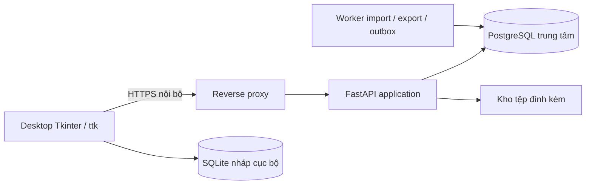

# WMS — Hệ thống quản lý kho desktop qua LAN

[](https://github.com/TEAM-DEV-FIVE/WMS_BA_2_0/actions/workflows/validate.yml)

Bộ hồ sơ phân tích nghiệp vụ (BA), thiết kế kỹ thuật và mã nền tảng cho hệ thống quản lý kho dùng **Python/Tkinter, FastAPI và PostgreSQL**, phiên bản hồ sơ **2.0**, ứng dụng **0.1.0**.

**Trạng thái: đang triển khai, chưa nghiệm thu nghiệp vụ kho.** Đã tích hợp 18/26 nhánh: nền server/desktop, IAM/MFA/quyền theo kho, danh mục/owner/serial, PO/SO và duyệt, nhận/tồn đầu/giữ hàng/xuất/QC/di chuyển/soạn-đóng kiện/chuyển kho/trả hàng, [kiểm kê và kỳ kho](01_Tai_lieu/COUNTING_PERIODS.md), [UI import](01_Tai_lieu/IMPORT_DESKTOP.md), [đảo giao dịch](01_Tai_lieu/REVERSALS.md), [trường mở rộng](01_Tai_lieu/CUSTOM_FIELDS.md), [báo cáo/xuất](01_Tai_lieu/REPORTS_EXPORT.md) và [in/tem/HID](01_Tai_lieu/PRINTING_SCANNER.md). Bản local cuối đạt 1106 tests + 10 subtests; [báo cáo và giới hạn](07_Kiem_tra/B18_INTEGRATION_2026_10_05.md). Recovery chung, triển khai LAN/Windows, tải/DR/UAT tiếp tục theo [phân công](01_Tai_lieu/PHAN_CONG/README.md). `requirements-dev.txt` chỉ phục vụ kiểm tra hồ sơ.

**Đồng bộ GitHub 06/10/2026:** đã đóng thêm 24 issue, hiện 27 CLOSED/13 OPEN. Mã ở
[`feat/application-foundation` / PR #46](https://github.com/TEAM-DEV-FIVE/WMS_BA_2_0/pull/46), chưa merge `main`. CI hồ sơ đạt; CI ứng dụng phát hiện lỗi
layout danh mục và Windows/timeout runner, đã ghi tại #14/#21. [Báo cáo và danh sách issue](07_Kiem_tra/GITHUB_ISSUE_REVIEW_2026_10_06.md).

**Bắt đầu chạy ứng dụng:** [hướng dẫn cài/chạy/kiểm thử và thứ tự issue](01_Tai_lieu/IMPLEMENTATION.md). Xem [kết quả kiểm tra đợt nền tảng](07_Kiem_tra/IMPLEMENTATION_REVIEW.md) và [trạng thái từng issue/test](07_Kiem_tra/implementation_status.json).

## Baseline triển khai hiện hành

[Phạm vi và baseline TL01](01_Tai_lieu/SCOPE_BASELINE.md) tiếp nhận quyết định tech lead ngày 02/10/2026: hạn bàn giao 22/10/2026; 1 kho trung tâm/3 phân khu, 15 CCU; RPO <1 giờ, RTO <4 giờ. Q01–Q08 đã có câu trả lời và người theo dõi, đồng thời ghi rõ chi tiết cần làm rõ. Đây là baseline của nhóm đồ án, chưa phải biên bản nghiệm thu doanh nghiệp. Các số liệu khác trong hồ sơ lịch sử được xử lý theo baseline này.

## Mục lục

- [Phạm vi nghiệp vụ](#phạm-vi-nghiệp-vụ)
- [Kiến trúc dự kiến](#kiến-trúc-dự-kiến)
- [Cấu trúc repository](#cấu-trúc-repository)
- [Lộ trình đọc tài liệu](#lộ-trình-đọc-tài-liệu)
- [Thiết lập và kiểm tra nhanh](#thiết-lập-và-kiểm-tra-nhanh)
- [Kiểm tra PostgreSQL](#kiểm-tra-postgresql)
- [Nhập dữ liệu mẫu](#nhập-dữ-liệu-mẫu)
- [API và phân quyền](#api-và-phân-quyền)
- [Chỉnh sửa và đóng góp](#chỉnh-sửa-và-đóng-góp)
- [Kết quả kiểm tra và giới hạn](#kết-quả-kiểm-tra-và-giới-hạn)
- [Lộ trình triển khai](#lộ-trình-triển-khai)

## Phạm vi nghiệp vụ

- Danh mục hàng, đơn vị tính/quy đổi, barcode, đối tác, kho và vị trí.
- Mua/bán, nhận/xuất hàng từng phần, giữ chỗ, soạn hàng và đóng kiện.
- Theo dõi hàng thường, theo lô/hạn dùng hoặc theo serial.
- Chuyển kho qua vị trí trung chuyển; trả hàng, điều chỉnh và đảo giao dịch.
- Phê duyệt, kiểm kê, khóa kỳ, audit và phân quyền theo kho.
- Nhập liệu theo staging/preview/commit; 8 báo cáo, 4 mẫu in, 2 loại tem trong phạm vi thiết kế.

Quy mô được tech lead chốt: **1 kho trung tâm với 3 phân khu, tối đa 15 người đồng thời, khoảng 20 GB trong 3 năm**. Bộ tải cũ 5 kho/30 người/50.000 SKU/1 triệu dòng sổ/200 dòng mỗi phiếu là cấu hình thử sức tải, không phải quy mô thực tế đã xác nhận hoặc kết quả benchmark. Multi-company/3PL, giá vốn kế toán, RFID, mobile native và ghi sổ offline nằm ngoài phạm vi cơ sở.

## Kiến trúc dự kiến



PostgreSQL là nguồn dữ liệu chính thức; desktop gọi API và không giữ thông tin đăng nhập DB. SQLite chỉ lưu nháp/cache cục bộ, không dùng làm cơ sở dữ liệu dùng chung qua mạng. Lệnh ghi sổ phải xử lý quyền, version, idempotency, ledger/balance, audit và outbox trong cùng transaction. UI cập nhật widget trên main thread; HTTP chạy qua worker/queue.

Chi tiết: [ARCHITECTURE.md](01_Tai_lieu/ARCHITECTURE.md), [INVARIANTS.md](01_Tai_lieu/INVARIANTS.md), [các quyết định cần chốt](01_Tai_lieu/DECISIONS.md).

## Cấu trúc repository

| Đường dẫn | Nội dung |
| --- | --- |
| [01_Tai_lieu](01_Tai_lieu) | Tài liệu tổng 61 trang, BRD/SRS, 49 yêu cầu, 33 use case, quy tắc và hồ sơ kỹ thuật |
| [02_CSDL](02_CSDL) | PostgreSQL DDL/seed, DBML, mô hình 56 bảng/355 cột/105 FK, SQLite local draft và truy vấn đối soát |
| [iam_extension_model.json](02_CSDL/iam_extension_model.json) | Mở rộng IAM theo migration 003; runtime sau 003: 60 bảng/385 cột/113 FK |
| [master_extension_model.json](02_CSDL/master_extension_model.json) | Mở rộng danh mục theo migration 005; runtime sau 005: 60 bảng/393 cột/113 FK |
| [ownership_extension_model.json](02_CSDL/ownership_extension_model.json) | Mở rộng owner/bảo hành theo migration 006; runtime sau 007: 63 bảng/424 cột/123 FK |
| [order_extension_model.json](02_CSDL/order_extension_model.json) | Mở rộng snapshot duyệt/đóng thiếu theo migration 008; runtime sau 008: 63 bảng/428 cột/125 FK |
| [receiving_extension_model.json](02_CSDL/receiving_extension_model.json) | Migration 009 thêm execution ACK/hash; runtime sau 009: 63 bảng/430 cột/125 FK |
| [opening_extension_model.json](02_CSDL/opening_extension_model.json) | Migration 010 thêm kế hoạch tồn đầu kỳ; sau 010: 65 bảng/440 cột/129 FK |
| [reversal_extension_model.json](02_CSDL/reversal_extension_model.json) | Migration 020 thêm đảo giao dịch; runtime sau 020: 89 bảng/584 cột/188 FK |
| [custom_field_extension_model.json](02_CSDL/custom_field_extension_model.json) | Release 021 báo cáo/xuất và 022 trường mở rộng: runtime 97 bảng/638 cột/203 FK |
| [printing_extension_model.json](02_CSDL/printing_extension_model.json) | Release 023 in/tem/HID: runtime 100 bảng/679 cột/211 FK |
| [03_So_do](03_So_do) | Atlas 91 trang, SVG, draw.io, PlantUML; ERD, class, use case, trạng thái, sequence, BPMN và mô hình khái niệm |
| [04_Phan_quyen](04_Phan_quyen) | 10 vai trò, 58 quyền, 125 ánh xạ role-permission, policy và phạm vi quyền |
| [05_API](05_API) | Contract thiết kế 23 paths lõi và OpenAPI runtime 185 paths; coverage theo use case |
| [06_Nhap_lieu](06_Nhap_lieu) | Excel, 14 CSV templates, 22 dòng ví dụ và validator offline |
| [07_Kiem_tra](07_Kiem_tra) | Báo cáo kiểm tra, truy vết và đặc tả acceptance T01–T28 |
| [scripts](scripts) | Kiểm tra artifact/PostgreSQL và cập nhật ZIP/checksum |
| [tests](tests) | Hồi quy nghiệp vụ/API/desktop, CSV và PostgreSQL |
| [apps](apps) / [packages/contracts](packages/contracts) | Server, desktop và DTO dùng chung |
| [migrations](migrations) | Migration có phiên bản/checksum, chạy riêng trước server |
| [.github/workflows/application.yml](.github/workflows/application.yml) | Unit/contract/wheel, Windows Tk và integration PostgreSQL 15/16 |
| [.github/workflows/validate.yml](.github/workflows/validate.yml) | CI kiểm tra artifact, CSV và SQL trên PostgreSQL 15/16 |
| [SHA256SUMS.txt](SHA256SUMS.txt) | Checksum các file repository, ngoại trừ chính manifest |

## Lộ trình đọc tài liệu

1. [Cách đọc hồ sơ BA](01_Tai_lieu/BA/00_CACH_DOC.md) và [tài liệu tổng PDF](01_Tai_lieu/Thiet_ke_WMS_Tkinter_LAN.pdf).
2. [BRD](01_Tai_lieu/BA/01_BRD.md), [SRS](01_Tai_lieu/BA/03_SRS.md), [quy trình](01_Tai_lieu/BA/04_QUY_TRINH.md) và [use case](01_Tai_lieu/USE_CASES.md).
3. [Kiến trúc](01_Tai_lieu/ARCHITECTURE.md), [bất biến giao dịch](01_Tai_lieu/INVARIANTS.md), [RBAC](04_Phan_quyen/RBAC.md) và [hợp đồng API](05_API/README.md).
4. [Atlas sơ đồ PDF](03_So_do/00_Tong_hop/Diagram_Atlas.pdf), [mục lục sơ đồ](03_So_do/00_Tong_hop/diagram_index.md) và [từ điển dữ liệu](02_CSDL/data_dictionary.csv).
5. [Báo cáo rà soát hiện tại](07_Kiem_tra/PROJECT_REVIEW.md) và [câu hỏi còn mở Q01–Q08](01_Tai_lieu/BA/open_questions.json).

## Thiết lập và kiểm tra nhanh

Yêu cầu: Git và Python **3.12+**. Các bước dưới kiểm tra bộ hồ sơ; chạy ứng dụng cần PostgreSQL và dependency theo [hướng dẫn triển khai](01_Tai_lieu/IMPLEMENTATION.md). Đọc PDF/SVG/Markdown không cần cài Python.

```bash
git clone https://github.com/TEAM-DEV-FIVE/WMS_BA_2_0.git
cd WMS_BA_2_0
python3 -m venv .venv
source .venv/bin/activate
python -m pip install -r requirements-dev.txt
python -m unittest discover -s tests -v
python scripts/check_artifacts.py
```

Windows PowerShell: thay hai lệnh tạo/kích hoạt môi trường bằng `py -3.12 -m venv .venv` và `.\.venv\Scripts\Activate.ps1`; các lệnh `python` sau đó giữ nguyên. Với repo private, tài khoản GitHub phải có quyền đọc. Trên Ubuntu, nếu thiếu module `venv`, cài gói `python3-venv` tương ứng.

`check_artifacts.py` kiểm tra định dạng JSON/CSV/XML/XLSX/ZIP, liên kết Markdown nội bộ, tham chiếu draw.io/BPMN, mô hình dữ liệu/FK, ma trận quyền, traceability, OpenAPI, SQLite và checksum. Bất kỳ lỗi nào phải được xử lý trước commit. CI chạy cùng bộ kiểm tra khi push hoặc mở pull request.

## Kiểm tra PostgreSQL

DDL yêu cầu **PostgreSQL 15+** và database trống; không phải migration nâng cấp database đã có dữ liệu. Seed tạo vai trò/quyền nghiệp vụ, không tạo người dùng WMS hay mật khẩu mặc định.

Trên Linux/macOS đã có bộ công cụ server PostgreSQL (`pg_config`, `initdb`, `pg_ctl`, `psql`), chạy bằng tài khoản thường:

```bash
python scripts/check_postgres.py
```

Lệnh tạo cluster tạm, chỉ mở Unix socket trong thư mục tạm, nạp DDL/seed, kiểm tra các ràng buộc và trigger, đối chiếu cột SQL với JSON và quyền seed với policy, rồi dừng/xóa cluster. Không kết nối database đang vận hành. Script đã được chạy trên Linux/PostgreSQL 16.15; macOS chưa được kiểm thử trực tiếp.

Nếu đã chuẩn bị **database phát triển trống** với quyền tạo schema, dùng `psql` trên Linux/macOS/Windows:

```bash
psql -X -h localhost -U wms_dev -d wms_dev -v ON_ERROR_STOP=1 -f 02_CSDL/001_schema.sql
psql -X -h localhost -U wms_dev -d wms_dev -v ON_ERROR_STOP=1 -f 02_CSDL/002_seed_permissions.sql
psql -X -h localhost -U wms_dev -d wms_dev -v ON_ERROR_STOP=1 -f tests/sql/schema_smoke.sql
psql -X -h localhost -U wms_dev -d wms_dev -v ON_ERROR_STOP=1 -f 02_CSDL/reconcile.sql
```

Thay host/user/database bằng cấu hình của bạn; để `psql` hỏi mật khẩu hoặc dùng cơ chế quản lý mật khẩu PostgreSQL. Không ghi thông tin đăng nhập thật vào repository. Bốn truy vấn đối soát phải trả **0 dòng** trên database vừa khởi tạo. Smoke test tự rollback dữ liệu giả; DDL/seed chỉ chạy một lần trên DB trống.

## Nhập dữ liệu mẫu

```bash
python 06_Nhap_lieu/imports/validate_csv.py 06_Nhap_lieu/imports/examples
python 06_Nhap_lieu/imports/validate_csv.py 06_Nhap_lieu/imports/templates
```

Kết quả mẫu: `rows_checked: 22`, `errors: []`; templates chỉ có header nên là 0 dòng. Exit code: **0** hợp lệ, **1** lỗi dữ liệu/tệp, **2** sai tham số. Có thể kiểm tra một phần các mẫu nếu giữ đúng tên CSV theo manifest. Thư mục không tồn tại/rỗng, tên file lạ, sai header, thiếu/thừa cột, encoding hoặc kiểu dữ liệu đều bị báo lỗi.

CSV dùng UTF-8 BOM, dấu phẩy phân cột và dấu chấm thập phân. Mã/barcode/serial phải giữ số 0 đầu. Excel có 14 sheet nhập liệu cùng 2 sheet hướng dẫn/quy tắc. Dữ liệu examples là dữ liệu giả; validator chưa kiểm tra FK, quyền, tồn kho hoặc các quy tắc nghiệp vụ. Ứng dụng đã có [server import](01_Tai_lieu/IMPORTS.md) và [giao diện preview/commit](01_Tai_lieu/IMPORT_DESKTOP.md); chứng từ nhập tiếp tục theo quy trình duyệt của từng nghiệp vụ. Xem [hướng dẫn mẫu nhập liệu](06_Nhap_lieu/imports/README.md).

## API và phân quyền

[openapi_core.json](05_API/openapi_core.json) là hợp đồng thiết kế, có thể mở bằng công cụ hỗ trợ OpenAPI. `https://wms.example.internal/api/v1` là địa chỉ minh họa. Có path trong hợp đồng chưa đồng nghĩa endpoint đã chạy.

Hợp đồng mô tả lệnh ghi sổ, giữ chỗ, chuyển kho, duyệt, kiểm kê, commit nhập và tra cứu operation. Decimal truyền dạng chuỗi; lệnh thay đổi dùng idempotency và kiểm soát version. Coverage thiết kế của từng UC được ghi tại [BA_COVERAGE.md](05_API/BA_COVERAGE.md). Các endpoint đã triển khai, gồm đăng nhập/MFA, chứng từ, kiểm kê và đảo giao dịch, nằm trong [OpenAPI runtime](05_API/openapi_runtime.json); các phần tiếp theo theo [sổ phân công](01_Tai_lieu/PHAN_CONG/README.md).

Server đã kiểm tra grant/quyền theo kho, hiệu lực, thu hồi và quyền giá cho các API được liệt kê trong [OpenAPI runtime](05_API/openapi_runtime.json). `SYSADMIN` không mặc nhiên có quyền kho; API quản trị yêu cầu MFA. Các nghiệp vụ chưa triển khai vẫn cần tích hợp authorization khi được thêm. [Hướng dẫn IAM](01_Tai_lieu/IDENTITY.md) mô tả bootstrap, phiên và phân tách nhiệm vụ. [Hướng dẫn danh mục](01_Tai_lieu/MASTER_DATA.md) mô tả migration 005, API và các form mới. [Hướng dẫn truy vết](01_Tai_lieu/TRACEABILITY.md) mô tả migration 006/007, tồn theo owner và bảo hành serial. [PO/SO và phê duyệt](01_Tai_lieu/ORDERS_APPROVAL.md) mô tả migration 008, quyền, trạng thái và desktop mới.

## Chỉnh sửa và đóng góp

- Giữ mã requirement/use case/business rule và cập nhật [traceability](07_Kiem_tra/BA/traceability.md) khi thay đổi yêu cầu.
- Sửa sơ đồ bằng [WMS_Design.drawio](03_So_do/00_Tong_hop/WMS_Design.drawio) hoặc draw.io từng nhóm; đồng bộ SVG/PDF và mô hình liên quan. Nguồn PlantUML giữ ngữ nghĩa nhưng có thể render bố cục khác. BPMN là mô hình non-executable.
- Khi sửa CSDL, đồng bộ `model.json`, SQL, DBML, từ điển dữ liệu và các sơ đồ chịu ảnh hưởng. Sau khi có hệ thống đang chạy, cần migration có phiên bản thay vì nạp lại DDL nền.
- Không commit `.venv`, cache, DB local, `.env`, mật khẩu hoặc khóa bí mật. Git giữ nguyên byte CSV để bảo toàn BOM/CRLF và checksum.
- Chưa có file LICENSE; tác giả chưa chỉ định giấy phép phân phối lại.

Sau khi kiểm tra nội dung thay đổi, đồng bộ ZIP nhập liệu và checksum, rồi chạy kiểm tra:

```bash
python scripts/update_artifacts.py
python -m unittest discover -s tests -v
python scripts/check_artifacts.py
python scripts/check_postgres.py
git diff --check
git status --short
```

`update_artifacts.py` lấy danh sách file từ Git, gồm file đã theo dõi và file mới chưa bị ignore. Rà soát `git status` trước khi chạy để tránh đưa file ngoài ý muốn vào manifest. Lệnh này chỉ tái tạo ZIP nhập liệu/checksum, **không tự sinh lại PDF hoặc sơ đồ**. Nếu chỉ đọc/clone thì không cần chạy cập nhật.

## Kết quả kiểm tra và giới hạn

Lần rà soát ngày **27/09/2026**: 12 test CSV đạt; JSON/CSV/XML, OpenAPI và SQLite hợp lệ; PostgreSQL 16.15 nạp DDL/seed thành công, kiểm tra 17 trường hợp bị từ chối bởi FK/CHECK/UNIQUE/trigger, đối chiếu schema/quyền và đối soát DB rỗng đạt. Chi tiết và phạm vi xem [PROJECT_REVIEW.md](07_Kiem_tra/PROJECT_REVIEW.md); trạng thái CI mới nhất ở badge đầu trang.

Repository hiện thuộc **TEAM-DEV-FIVE**. Sau khi chuyển repo, CI đã khởi chạy được; [lần chạy 36308545818](https://github.com/TEAM-DEV-FIVE/WMS_BA_2_0/actions/runs/36308545818) xác nhận hai job PostgreSQL 15/16 đạt và phát hiện thiếu đường dẫn cache cho `requirements-dev.txt`. Cấu hình cache đã được bổ sung; xem badge đầu trang để biết kết quả toàn bộ workflow trên commit mới nhất. Lỗi billing của lần push đầu tại tài khoản cũ được lưu trong báo cáo lịch sử.

FastAPI/Tkinter và các race ghi sổ đã được kiểm thử trên Linux/PostgreSQL 16; xem [báo cáo B07/B17](07_Kiem_tra/B07_B17_INTEGRATION_2026_10_05.md). Chưa nghiệm thu nghiệp vụ, tải 15 CCU, máy quét/in, backup/restore hoặc Windows client đích. `acceptance_tests.csv` là **đặc tả T01–T28 chưa nghiệm thu đầy đủ**; test thành phần không thay thế kết quả các ca này. T27/T28 bổ sung cho ký gửi và tra cứu bảo hành theo Q02. Các báo cáo v1.x và BA trước đây là lịch sử; số liệu/trạng thái trong đó cần đọc theo phiên bản.

Q01–Q08 đã được tiếp nhận từ bảng quyết định của tech lead; xem [baseline TL01](01_Tai_lieu/SCOPE_BASELINE.md) và [sổ câu hỏi](01_Tai_lieu/BA/open_questions.json) để phân biệt câu trả lời, người theo dõi và chi tiết cần làm rõ trước triển khai/production.

## Lộ trình triển khai

Đã tích hợp 18/26 nhánh. Phần còn lại theo [dependency và phân công](01_Tai_lieu/PHAN_CONG/README.md):

1. Giao song song B19 recovery và B20 worker: đã đồng bộ nền `80fcf3f`, READY; B01–B18 đã tích hợp.
2. Tiếp tục B19–B24 theo dependency: recovery, worker, vận hành LAN/DR, Windows và tải.
3. B25/B26 tổng rà soát và nghiệm thu T01–T28 trên môi trường mục tiêu.
