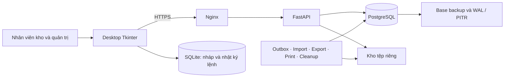

# WMS — Warehouse Management System

<table align="center">
  <tr>
    <td align="center" width="260">
      <strong>Windows</strong><br><br>
      <a href="https://github.com/TEAM-DEV-FIVE/WMS_BA_2_0/releases/download/v0.1.0-handover.1/WMS-Setup-0.1.0-97d4c510dab8-x64.exe"></a><br><br>
      <a href="https://github.com/TEAM-DEV-FIVE/WMS_BA_2_0/releases/download/v0.1.0-handover.1/WMS-Setup-0.1.0-97d4c510dab8-x64.exe"><strong>Tải Windows (.exe)</strong></a><br>
      <sub>Desktop x64<br>Windows 10/11</sub>
    </td>
    <td align="center" width="260">
      <strong>macOS</strong><br><br>
      <a href="https://github.com/TEAM-DEV-FIVE/WMS_BA_2_0/releases/download/v0.1.0-handover.1/WMS-macos-arm64-TEST-ONLY.zip"></a><br><br>
      <a href="https://github.com/TEAM-DEV-FIVE/WMS_BA_2_0/releases/download/v0.1.0-handover.1/WMS-macos-arm64-TEST-ONLY.zip"><strong>Tải macOS (.zip)</strong></a><br>
      <sub>Desktop ARM64<br>Build VM: macOS 15</sub>
    </td>
    <td align="center" width="260">
      <strong>Linux</strong><br><br>
      <a href="https://github.com/TEAM-DEV-FIVE/WMS_BA_2_0/releases/download/v0.1.0-handover.1/WMS-Server-0.1.0-97d4c510dab8-linux-x64.tar.gz"></a><br><br>
      <a href="https://github.com/TEAM-DEV-FIVE/WMS_BA_2_0/releases/download/v0.1.0-handover.1/WMS-Server-0.1.0-97d4c510dab8-linux-x64.tar.gz"><strong>Tải Linux Server (.tar.gz)</strong></a><br>
      <sub>Server offline x64<br>Ubuntu 24.04</sub>
    </td>
  </tr>
</table>

Windows đã build/cài thử trên **Server 2022 x64**; macOS đã build/cài thử trên **15 ARM64**.
Phạm vi kiểm chứng và chữ ký bộ cài được ghi tại [trạng thái phát hành](#trạng-thái-nghiệm-thu-và-phát-hành).

**Hệ thống quản lý kho desktop qua mạng LAN dành cho hàng điện tử và thiết bị IT.**

WMS kết hợp ứng dụng **Python/Tkinter**, API **FastAPI** và cơ sở dữ liệu **PostgreSQL** để quản lý hàng hóa từ tiếp nhận, lưu kho, soạn hàng đến xuất kho và đối soát. Dự án bao gồm mã nguồn, hồ sơ phân tích nghiệp vụ, kiểm thử tự động, công cụ triển khai và bộ tài liệu bàn giao.

[](https://github.com/TEAM-DEV-FIVE/WMS_BA_2_0/actions/workflows/application.yml)
[](https://github.com/TEAM-DEV-FIVE/WMS_BA_2_0/actions/workflows/validate.yml)

[Hướng dẫn người dùng](01_Tai_lieu/USER_GUIDE.md) · [Cài đặt và vận hành](01_Tai_lieu/OPERATIONS_RUNBOOK.md) · [Báo cáo bàn giao](07_Kiem_tra/release/FINAL_HANDOVER.md) · [Quyết định chấp thuận](07_Kiem_tra/release/OWNER_ACCEPTANCE.md)

## Phiên bản bàn giao

| Nội dung | Thông tin |
| --- | --- |
| Phiên bản ứng dụng | **0.1.0** |
| Mã ứng dụng đã kiểm chứng | [`97d4c51`](https://github.com/TEAM-DEV-FIVE/WMS_BA_2_0/commit/97d4c510dab8370643b7d55e85d6788443b5e209) |
| Phạm vi tích hợp | B01–B26: nghiệp vụ, desktop, vận hành, kiểm thử và tài liệu |
| API hiện hành | 189 đường dẫn trong [OpenAPI runtime](05_API/openapi_runtime.json) |
| Mô hình dữ liệu | 101 bảng, 690 cột; migration PostgreSQL 001–024 và SQLite 001–003 |
| Đơn vị tiếp nhận | InternTechLead — Trần Trung Kiên |
| Trạng thái bàn giao | Chủ dự án chấp thuận bàn giao và đóng backlog; phạm vi bằng chứng tại [biên bản quyết định](07_Kiem_tra/release/OWNER_ACCEPTANCE.md) |

## Chức năng chính

| Nhóm chức năng | Khả năng |
| --- | --- |
| **Danh mục và truy vết** | Sản phẩm, đơn vị tính và quy đổi, barcode, đối tác, kho/vị trí; theo dõi hàng thường, lô/hạn dùng, serial và chứng cứ bảo hành |
| **Chứng từ và phê duyệt** | PO/SO, tiếp nhận từng phần, tồn đầu kỳ; quy trình duyệt theo phiên bản và phân tách nhiệm vụ |
| **Vận hành kho** | Giữ hàng, soạn và đóng kiện, xuất kho, di chuyển nội bộ, chuyển kho qua trung chuyển, xử lý thiếu/hỏng và trả hàng |
| **Kiểm soát tồn** | Sổ phát sinh, số dư, kiểm kê, khóa kỳ và đảo giao dịch có truy vết; tách hàng doanh nghiệp và hàng ký gửi |
| **Import và báo cáo** | Upload, kiểm tra, preview, lỗi từng dòng và xác nhận commit; báo cáo R01–R08, CSV/XLSX và lịch sử import/export có phân trang |
| **In và quét mã** | Chứng từ PDF tiếng Việt, tem vị trí/sản phẩm, barcode/QR, nhập liệu bằng máy quét HID và kiểm soát in lại |
| **Đăng nhập và phân quyền** | MFA, phiên đăng nhập, quyền theo kho/thời hạn, phê duyệt cấp quyền, che giá và kiểm tra quyền hiện tại tại API |
| **Nháp và phục hồi** | SQLite tách theo server/người dùng/thiết bị; lưu lệnh trước khi gửi, xử lý mất phản hồi và gửi lại đúng idempotency key |
| **Vận hành hệ thống** | Audit, outbox, 6 worker, HTTPS, health/readiness, cài offline, backup/PITR, nâng cấp và rollback |

Quy mô thiết kế: **1 kho trung tâm, 3 phân khu, 15 người dùng đồng thời**; dữ liệu dự kiến khoảng **20 GB trong 3 năm**. Đây là baseline triển khai, không phải cam kết benchmark trên mọi cấu hình. Kế toán giá vốn/công nợ, đa pháp nhân/3PL, sản xuất, RFID/mobile native và ghi sổ offline nằm ngoài phạm vi phiên bản này.

## Kiến trúc



PostgreSQL là nguồn dữ liệu chính thức. Desktop gọi API, không kết nối trực tiếp vào database. SQLite lưu nháp và thông tin phục hồi cục bộ; thao tác ghi sổ cần kết quả xác nhận từ server.

Lệnh thay đổi dữ liệu kiểm tra quyền, trạng thái và phiên bản; sổ tồn, số dư, audit, outbox và kết quả idempotency được ghi nguyên tử. Worker xử lý tác vụ nền, còn thao tác I/O và in nằm ngoài transaction nghiệp vụ. Xem [kiến trúc hiện hành](03_So_do/RUNTIME_GUIDE.md), [bất biến nghiệp vụ](01_Tai_lieu/INVARIANTS.md) và [cơ chế phục hồi](01_Tai_lieu/RECOVERY_ALL.md).

## Cài đặt

### Nhận bộ bàn giao

[Hướng dẫn bắt đầu](07_Kiem_tra/release/BAT_DAU_TAI_DAY.md) mô tả gói server offline, Windows x64, macOS ARM64, source archive và cách xác minh checksum. [Biên nhận](07_Kiem_tra/release/DELIVERY.json) lưu commit, kích thước và SHA-256 của từng cấp gói.

Tải bộ cài riêng theo hệ điều hành bằng các biểu tượng phía trên hoặc tại [GitHub Releases](https://github.com/TEAM-DEV-FIVE/WMS_BA_2_0/releases/tag/v0.1.0-handover.1). Release có tệp `SHA256SUMS.txt` để đối chiếu ba gói tải. Đây là bản bàn giao với chữ ký lab như mô tả bên dưới.

Bản nén đầy đủ `WMS-InternTechLead-97d4c51.tar.gz` được lưu trong workspace của chủ dự án. Binary được phân phối qua Releases, không nằm trong lịch sử Git; artifact CI vẫn có thời hạn lưu trữ.

### Phát triển từ mã nguồn

Yêu cầu: **Python 3.12**, Git, Tkinter và PostgreSQL 15/16. Profile triển khai server dùng **Ubuntu 24.04 x64, PostgreSQL 16 và Nginx**.

```bash
git clone https://github.com/TEAM-DEV-FIVE/WMS_BA_2_0.git
cd WMS_BA_2_0
python3 -m venv .venv
source .venv/bin/activate
python -m pip install -r requirements-app-lock.txt
python -m pip install --no-deps --no-build-isolation -e .
```

Trên Windows PowerShell, tạo môi trường bằng `py -3.12 -m venv .venv`, kích hoạt bằng `.\.venv\Scripts\Activate.ps1`, rồi chạy cùng hai lệnh `pip`. Linux cần gói Tkinter phù hợp với Python; kiểm thử GUI không có màn hình cần Xvfb.

### Khởi chạy môi trường phát triển

Chuẩn bị database phát triển riêng và cấu hình kết nối của bạn. Ví dụ dưới dùng xác thực PostgreSQL đã được cấu hình trên máy:

```bash
export WMS_DATABASE_URL='postgresql+psycopg://wms_dev@localhost:5432/wms_dev'
python -m apps.server.infrastructure.migrations
python -m apps.server
```

Trong terminal khác, kích hoạt cùng môi trường Python:

```bash
export WMS_API_URL='http://127.0.0.1:8000/api/v1'
python -m apps.desktop
```

Cấu hình và bootstrap tài khoản quản trị theo [hướng dẫn IAM](01_Tai_lieu/IDENTITY.md); ứng dụng không cung cấp mật khẩu mặc định. Kết nối LAN sử dụng HTTPS với CA được client tin cậy. Triển khai API và các worker theo [runbook LAN](01_Tai_lieu/LAN_DEPLOYMENT.md), không dùng ví dụ phát triển để thay cấu hình vận hành.

## Kiểm thử và chất lượng

Bằng chứng dưới đây gắn với runtime `97d4c51`; badge phía trên phản ánh các lần chạy mới trên `main`.

| Môi trường / phạm vi | Kết quả |
| --- | --- |
| Linux, PostgreSQL 16, Tk/Xvfb, HTTPS/LAN và backup | **1.320 test + 10 subtest đạt**, không lỗi hoặc skip |
| CI PostgreSQL 15 | **1.266 test + 10 subtest đạt**, kiểm đủ số ca đã thu |
| CI PostgreSQL 16 | **1.266 test + 10 subtest đạt**, kiểm đủ số ca đã thu |
| CI Windows | **586 unit test + 10 subtest**, **14 GUI test** và kiểm tra package đạt |
| Native VM | Windows Server 2022 x64 và macOS 15 ARM64: build, ký lab và chạy thử bản đã cài đạt |
| Cài server offline | 58 dependency wheel; 209 module, 189 API path, SQLite và PDF chạy từ môi trường cài sạch |

Các bộ kiểm thử có phần giao nhau, không cộng các hàng thành tổng số ca độc lập. Xem [báo cáo và evidence](07_Kiem_tra/release/FINAL_HANDOVER.md), [CI ứng dụng](https://github.com/TEAM-DEV-FIVE/WMS_BA_2_0/actions/runs/37471975858) và [native build](https://github.com/TEAM-DEV-FIVE/WMS_BA_2_0/actions/runs/37471976127).

Chạy unit test và kiểm tra contract:

```bash
python scripts/check_application.py --suite unit
python scripts/export_runtime_contract.py --check
python -m ruff check apps packages tests scripts
```

Chạy hồi quy đầy đủ trên Linux có PostgreSQL 16 tools, Nginx và Xvfb:

```bash
python scripts/check_application.py --gui --jobs 4 --expected-pg-major 16 \
  --test-path tests --test-path deploy/lan/tests --test-path deploy/backup/tests \
  --report .reports/application-full.xml
python scripts/check_artifacts.py
```

Runner tạo database tạm, đối chiếu collection giữa các tiến trình và không dùng database vận hành. Không có môi trường hoặc có ca bị skip sẽ không được coi là kết quả đạt của bộ đầy đủ.

## Tài liệu

| Nhu cầu | Tài liệu |
| --- | --- |
| Thao tác nghiệp vụ và đào tạo | [Hướng dẫn người dùng](01_Tai_lieu/USER_GUIDE.md), [bài thực hành](01_Tai_lieu/TRAINING.md) |
| Cài đặt, nâng cấp, rollback | [Bàn giao](01_Tai_lieu/HANDOVER.md), [vận hành](01_Tai_lieu/OPERATIONS_RUNBOOK.md), [LAN](01_Tai_lieu/LAN_DEPLOYMENT.md) |
| Sao lưu và phục hồi | [Backup/PITR](01_Tai_lieu/BACKUP_RESTORE.md), [công cụ backup](deploy/backup/README.md) |
| API và dữ liệu | [OpenAPI runtime](05_API/openapi_runtime.json), [review contract](05_API/CONTRACT_REVIEW.md), [migrations](migrations) |
| Yêu cầu và thiết kế | [BRD](01_Tai_lieu/BA/01_BRD.md), [SRS](01_Tai_lieu/BA/03_SRS.md), [use case](01_Tai_lieu/USE_CASES.md), [atlas sơ đồ](03_So_do/00_Tong_hop/Diagram_Atlas.pdf) |
| Nhập liệu | [Mẫu CSV/Excel](06_Nhap_lieu/imports/README.md), [import](01_Tai_lieu/IMPORTS.md) |
| Kiểm thử và nghiệm thu | [Ma trận 49 yêu cầu](07_Kiem_tra/handover/requirements.csv), [T01–T28](07_Kiem_tra/acceptance_tests.csv), [quyết định bàn giao](07_Kiem_tra/release/OWNER_ACCEPTANCE.md) |

## Cấu trúc mã nguồn

```text
apps/desktop/          Giao diện, presenter, HTTP client, cache và phục hồi
apps/server/           API, application services, domain và infrastructure
packages/contracts/    DTO và contract dùng chung
migrations/            Migration PostgreSQL có phiên bản và checksum
deploy/                Triển khai LAN và backup/restore
packaging/             Đóng gói Windows và macOS
scripts/               Kiểm thử, contract, cài đặt và công cụ vận hành
tests/                 Kiểm thử nghiệp vụ, tích hợp, desktop và hồ sơ
01_Tai_lieu/            Yêu cầu, hướng dẫn, runbook và hồ sơ bàn giao
02_CSDL/ – 06_Nhap_lieu/ Mô hình, sơ đồ, phân quyền, API và mẫu dữ liệu
07_Kiem_tra/            Kế hoạch kiểm thử, traceability và evidence
```

## Trạng thái nghiệm thu và phát hành

Chủ dự án đã yêu cầu chấp thuận bàn giao và đóng toàn bộ issue của đợt triển khai. Quyết định này được lưu riêng với bằng chứng kiểm thử để phân biệt **chấp thuận quản lý** và **kết quả thực nghiệm**.

Các báo cáo local/CI/VM được giữ nguyên theo commit. Kiểm thử tại kho, thiết bị thật, DR độc lập và tải dữ liệu đích chưa có evidence độc lập trong repository; T01–T28 không được đổi thành PASS bằng suy luận. Windows hiện dùng chứng thư **TEST ONLY**, macOS ký **ad-hoc** và chưa notarization. Chi tiết phạm vi chấp thuận tại [OWNER_ACCEPTANCE.md](07_Kiem_tra/release/OWNER_ACCEPTANCE.md).

## Phát triển tiếp và giấy phép

Trước khi sửa, đọc [AGENTS.md](AGENTS.md) và quy trình trong repository. Giữ migration đã phát hành bất biến, bổ sung kiểm thử cho thay đổi nghiệp vụ và cập nhật contract/tài liệu tương ứng. Không commit dữ liệu vận hành, credential, private key hoặc môi trường `.venv`.

Sau khi thay đổi artifact, chạy `python scripts/update_artifacts.py`, `python scripts/check_artifacts.py` và `git diff --check`. Các bản PDF và báo cáo cũ là tài liệu theo mốc; dùng báo cáo bàn giao hiện hành để xác định trạng thái phiên bản.

Repository hiện chưa khai báo giấy phép phân phối lại. Mọi nhu cầu sử dụng hoặc phân phối ngoài phạm vi dự án cần được chủ sở hữu xác nhận.
